:::: {.columns style="align-items:center; margin-top:0.5em;"}
::: {.column width="58%"}
**Taller Programa de Campeon(a\|e)s**

Creando y dando una charla inolvidable

*De la idea a la acción*

**Alejandra Bellini**
:::
::: {.column width="38%"}

:::
::::

::: {style="display:flex; align-items:center; justify-content:space-between; margin-top:1em;"}
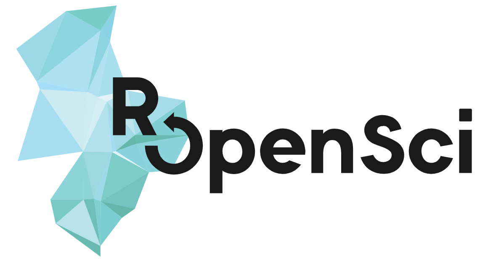

"Diseñado por pikisuperstar / Freepik"
:::

::: {.notes}
rcambio de saberes.
:::

---

## Ejercicio 1 {background-color="#F3F3F3"}

:::: {.columns}
::: {.column width="45%"}
💡

**Ejercicio 1:**\
¿Tenes una idea de charla, \
¿Diste una charla?, \
¿Cómo te fue?
:::
::: {.column width="50%"}
Usa el documento que compartimos en el chat y agrega al lado de tu nombre tu respuesta
:::
::::

## {background-color="#A4C2F4"}

¿Existe una fórmula para una buena charla?

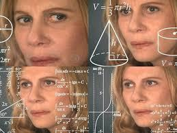

## La respuesta de Chris Anderson {background-color="#A4C2F4"}

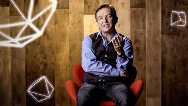

::: {.notes}
Chris Anderson (nacido en 1957) es un empresario británico-estadounidense que dirige TED, una organización sin ánimo de lucro que ofrece charlas basadas en ideas y organiza una conferencia anual en Vancouver, Columbia Británica (Canadá). Anteriormente fundó Future Publishing. También es el fundador del sitio web de periodismo sobre videojuegos IGN.
:::

## Armemos nuestra propia fórmula

## Armemos nuestra propia fórmula

IDEA

## Armemos nuestra propia fórmula

:::: {.columns style="align-items:center;"}
::: {.column width="30%"}

IDEA

:::
::: {.column width="65%" style="font-size:0.85em;"}
¿Cuál es la idea que quiero compartir con la audiencia?
:::
::::

## Armemos nuestra propia fórmula

:::: {.columns style="align-items:center;"}
::: {.column width="30%"}

IDEA

:::
::: {.column width="65%" style="font-size:0.85em;"}
Primer desafío:\
¿cómo encuentro mi idea?

Con una **Guía de Trabajo**
:::
::::

## {background-color="#A4C2F4"}

**Paso 1: Empezamos con los datos que sabemos**

## Primeros datos antes de desarrollar la idea

1. Nombre del evento
2. Fecha del evento
3. Temática general
4. Mi área/temática
5. Público del evento
6. Tiempo de la charla
7. Algún pedido especial del organizador

## Idea principal

1. Puedo tener más de una idea. Las escribo y las **jerarquizo**.
2. Es mejor focalizar sobre una sola idea. Debe ser el **hilo conductor**.
3. **Construir** la idea parte por parte a través de la charla. De lo conocido a lo desconocido.
4. Todo debe estar **conectado** de alguna manera a la idea principal

## Armemos nuestra propia fórmula

:::: {.columns style="align-items:center;"}
::: {.column width="35%"}

IDEA<small>Objetivo</small>

:::
::::

## Objetivo principal: ¿qué quiero lograr con mi charla?

1. Sumar gente a un proyecto
2. Contar una innovación
3. Replicar experiencias exitosas
4. Mostrar resultados
5. Inspirar
6. Enseñar procesos

::: {.notes}
:::

## Ejemplo - idea principal {background-color="#C9DAF8"}

💡 💡

**Idea:** todos podemos crear y ofrecer una charla inolvidable

**Objetivo:** mostrar la estructura de una charla y ofrecer herramientas para desarrollar una fórmula propia exitosa para dar charlas inolvidables

**Emoción:** inspirar y convencer que todos puedan dar una charla. Con práctica y herramientas útiles.

**¿Cómo?**\
Creando una fórmula y desarrollando cada parte para que los asistentes puedan seguir el paso a paso y crear la charla. Los ejemplos y los casos prácticos son fundamentales.

## Ejercicio 3: Idea {background-color="#F3F3F3"}

:::: {.columns}
::: {.column width="45%"}
💡

¿Practicamos?\
¿Se animan a describirla?

Usen el documento compartido
:::
::: {.column width="50%" style="font-size:0.85em;"}
1. Nombre del evento:
2. Fecha del evento:
3. Temática general:
4. Mi área/temática:
5. Público del evento:
6. Tiempo de la charla:
7. Algún pedido especial del organizador:
:::
::::

## Armemos nuestra propia fórmula

:::: {.columns style="align-items:center;"}
::: {.column width="60%"}

IDEA<small>Objetivo</small>
+
Estructura

:::
::::

## {background-color="#A4C2F4"}

**Paso 2: Seguimos con las partes de mi charla**

## Partes de una charla

:::: {.columns}
::: {.column width="32%"}
### Inicio

Capta la atención\
Es lo primero que van a escuchar\
Debe ser potente
:::
::: {.column width="32%"}
### Cuerpo

Debe contener toda la información de la idea que quiero compartir.\
Es variable
:::
::: {.column width="32%"}
### Cierre

Es lo último que van a escuchar\
Debe ser potente
:::
::::

## Partes de una charla

:::: {.columns}
::: {.column width="32%"}
### Inicio

Capta la atención\
Es lo primero que van a escuchar\
Debe ser potente

*¿Por qué me tienen que seguir escuchando?*
:::
::: {.column width="32%"}
### Cuerpo

Debe contener toda la información de la idea que quiero compartir.\
Es variable

*¿Cómo mantengo la atención?*
:::
::: {.column width="32%"}
### Cierre

Es lo último que van a escuchar\
Debe ser potente

*¿Qué quiero que se lleven de mi charla?*
:::
::::

## ¿Por qué me tienen que seguir escuchando?

:::: {.columns style="align-items:flex-start;"}
::: {.column width="25%"}

Inicio

:::
::: {.column width="70%"}
1. Pregunta
2. Anécdota
3. Número/Estadística
4. Foto/Imagen/Gráfico/Video
5. Problema
6. Objeto
:::
::::

## Inicio {background-color="#C9DAF8"}

:::: {.columns style="align-items:flex-start;"}
::: {.column width="15%"}

Inicio

:::
::: {.column width="80%"}
💡

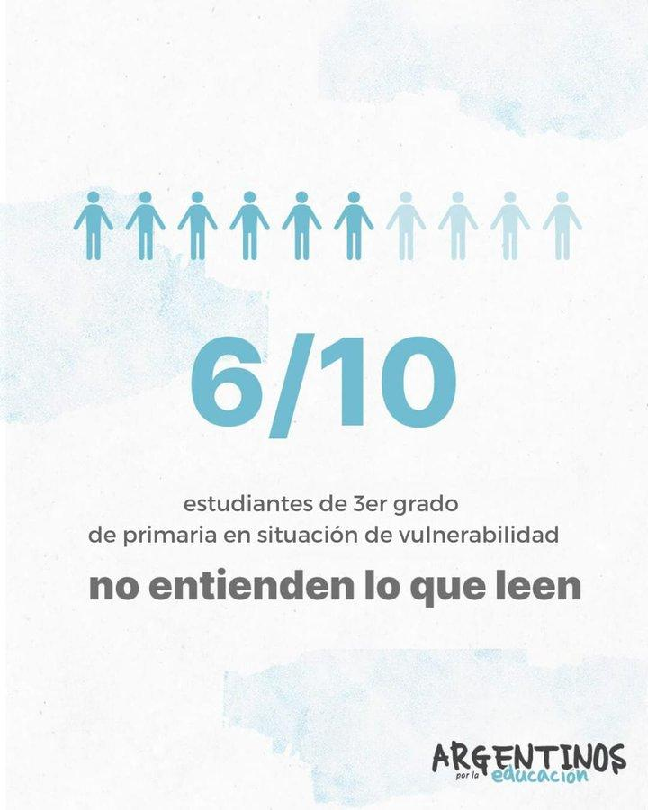
:::
::::

::: {.notes}
Usá herramientas de accesibilidad para ayudar a todo el mundo. Las notas de quien presenta son sólo un ejemplo de esto. Agrandá el cursor, usá keycaster para mostrar las teclas de control mientras escribís, cambiá al modo de alto contraste, todo ello ayuda a compensar un video que se corta por mala conexión a interntet o un video de mala calidad cuando tenés una pantalla de baja calidad.
wave.webaim.org/extension
grackledocs.com
:::

## Inicio {background-color="#C9DAF8"}

:::: {.columns style="align-items:flex-start;"}
::: {.column width="15%"}

Inicio

:::
::: {.column width="80%"}
💡

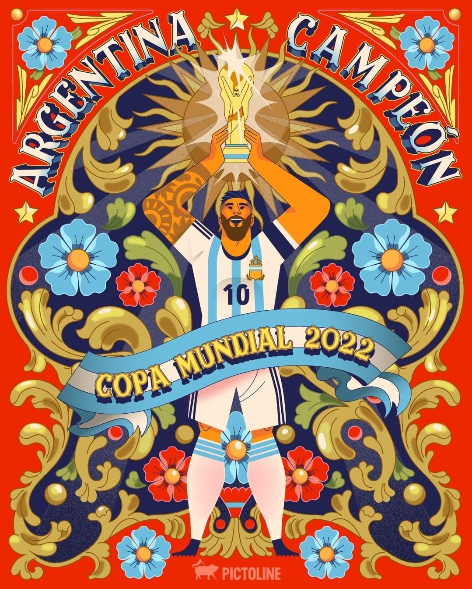
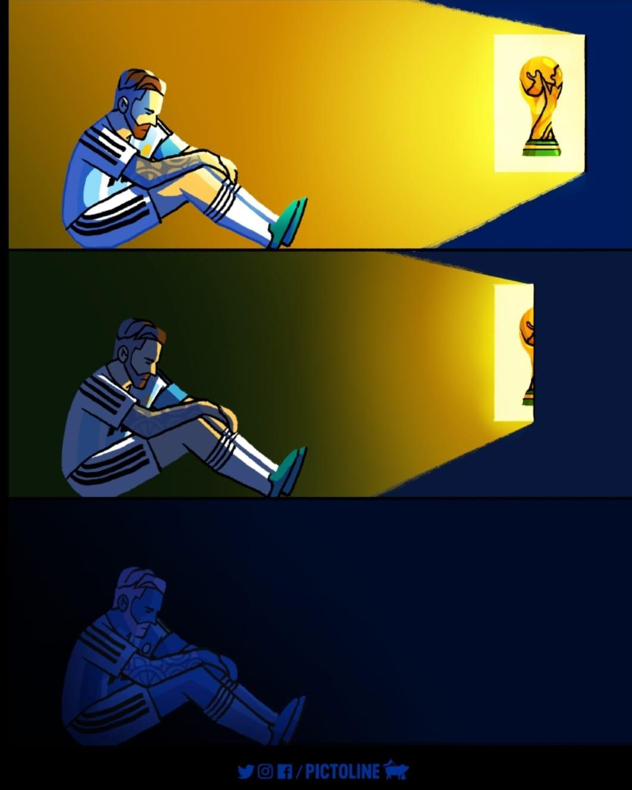
:::
::::

::: {.notes}
Usá herramientas de accesibilidad para ayudar a todo el mundo. Las notas de quien presenta son sólo un ejemplo de esto. Agrandá el cursor, usá keycaster para mostrar las teclas de control mientras escribís, cambiá al modo de alto contraste, todo ello ayuda a compensar un video que se corta por mala conexión a interntet o un video de mala calidad cuando tenés una pantalla de baja calidad.
wave.webaim.org/extension
grackledocs.com
:::

## Inicio {background-color="#C9DAF8"}

:::: {.columns style="align-items:flex-start;"}
::: {.column width="15%"}

Inicio

:::
::: {.column width="80%"}
💡

:::
::::

::: {.notes}
Usá herramientas de accesibilidad para ayudar a todo el mundo. Las notas de quien presenta son sólo un ejemplo de esto. Agrandá el cursor, usá keycaster para mostrar las teclas de control mientras escribís, cambiá al modo de alto contraste, todo ello ayuda a compensar un video que se corta por mala conexión a interntet o un video de mala calidad cuando tenés una pantalla de baja calidad.
wave.webaim.org/extension
grackledocs.com
:::

## Inicio {background-color="#C9DAF8"}

:::: {.columns style="align-items:flex-start;"}
::: {.column width="15%"}

Inicio

:::
::: {.column width="80%"}
💡

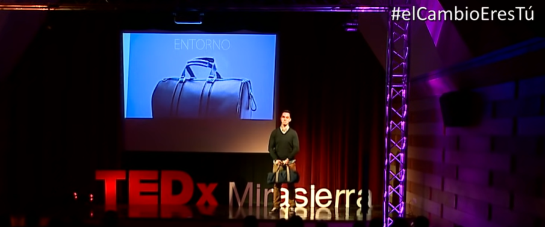
:::
::::

::: {.notes}
Usá herramientas de accesibilidad para ayudar a todo el mundo. Las notas de quien presenta son sólo un ejemplo de esto. Agrandá el cursor, usá keycaster para mostrar las teclas de control mientras escribís, cambiá al modo de alto contraste, todo ello ayuda a compensar un video que se corta por mala conexión a interntet o un video de mala calidad cuando tenés una pantalla de baja calidad.
wave.webaim.org/extension
grackledocs.com
:::

## ¿Cómo mantengo la atención?

:::: {.columns style="align-items:flex-start;"}
::: {.column width="25%"}

Cuerpo

:::
::: {.column width="70%"}
1. Contiene **todos los elementos** que permiten compartir mi idea: datos, gráficos, historias, experiencias, videos, fotos
2. Es muy **variable**
3. Lo más importante: tiene que tener un **hilo conductor**
:::
::::

## Cuerpo {background-color="#C9DAF8"}

:::: {.columns style="align-items:flex-start;"}
::: {.column width="15%"}

Cuerpo

:::
::: {.column width="80%"}
💡

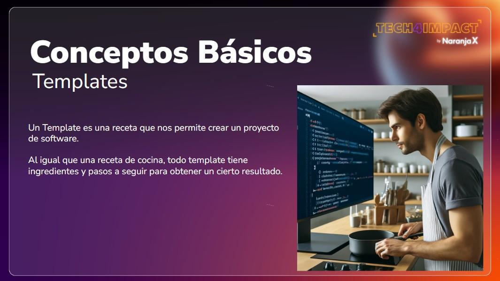
:::
::::

::: {.notes}
Usá herramientas de accesibilidad para ayudar a todo el mundo. Las notas de quien presenta son sólo un ejemplo de esto. Agrandá el cursor, usá keycaster para mostrar las teclas de control mientras escribís, cambiá al modo de alto contraste, todo ello ayuda a compensar un video que se corta por mala conexión a interntet o un video de mala calidad cuando tenés una pantalla de baja calidad.
wave.webaim.org/extension
grackledocs.com
:::

## Cuerpo {background-color="#C9DAF8"}

:::: {.columns style="align-items:flex-start;"}
::: {.column width="15%"}

Cuerpo

:::
::: {.column width="80%"}
💡

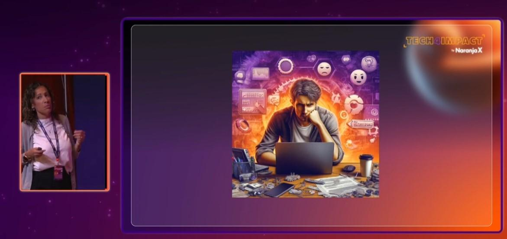
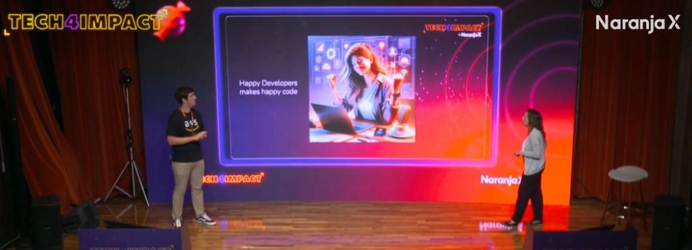
:::
::::

::: {.notes}
Usá herramientas de accesibilidad para ayudar a todo el mundo. Las notas de quien presenta son sólo un ejemplo de esto. Agrandá el cursor, usá keycaster para mostrar las teclas de control mientras escribís, cambiá al modo de alto contraste, todo ello ayuda a compensar un video que se corta por mala conexión a interntet o un video de mala calidad cuando tenés una pantalla de baja calidad.
wave.webaim.org/extension
grackledocs.com
:::

## {background-color="#A4C2F4"}

**La gran pregunta:**\
**¿Se entenderá lo que estoy contando?**

## Ejercicio 3 - Busco papel y lápiz para dibujar: {background-color="#F3F3F3"}

💡

1. Sigo las instrucciones y dibujo en el papel
2. No puedo hacer preguntas. Solo escuchen mis instrucciones y dibujen lo que entienden.
3. Todos mostramos el resultado.

## Dibujos: {background-color="#A4C2F4"}

:::: {.columns style="align-items:center;"}
::: {.column width="55%"}
Todos recibieron las mismas instrucciones. No todos decodificaron lo mismo.

Cuanto más claras son las instrucciones, más acertivo es mi mensaje.
:::
::: {.column width="40%"}

:::
::::

## {background-color="#A4C2F4"}

**Paso 3: La estrategia más importante: Storytelling,** *el arte de contar una historia*

## Ejemplos {background-color="#C9DAF8"}

💡

::: {.notes}
Usá herramientas de accesibilidad para ayudar a todo el mundo. Las notas de quien presenta son sólo un ejemplo de esto. Agrandá el cursor, usá keycaster para mostrar las teclas de control mientras escribís, cambiá al modo de alto contraste, todo ello ayuda a compensar un video que se corta por mala conexión a interntet o un video de mala calidad cuando tenés una pantalla de baja calidad.
wave.webaim.org/extension
grackledocs.com
:::

## Ejemplos {background-color="#C9DAF8"}

💡

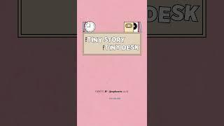

::: {.notes}
Usá herramientas de accesibilidad para ayudar a todo el mundo. Las notas de quien presenta son sólo un ejemplo de esto. Agrandá el cursor, usá keycaster para mostrar las teclas de control mientras escribís, cambiá al modo de alto contraste, todo ello ayuda a compensar un video que se corta por mala conexión a interntet o un video de mala calidad cuando tenés una pantalla de baja calidad.
wave.webaim.org/extension
grackledocs.com
:::

## Ejemplos {background-color="#C9DAF8"}

💡

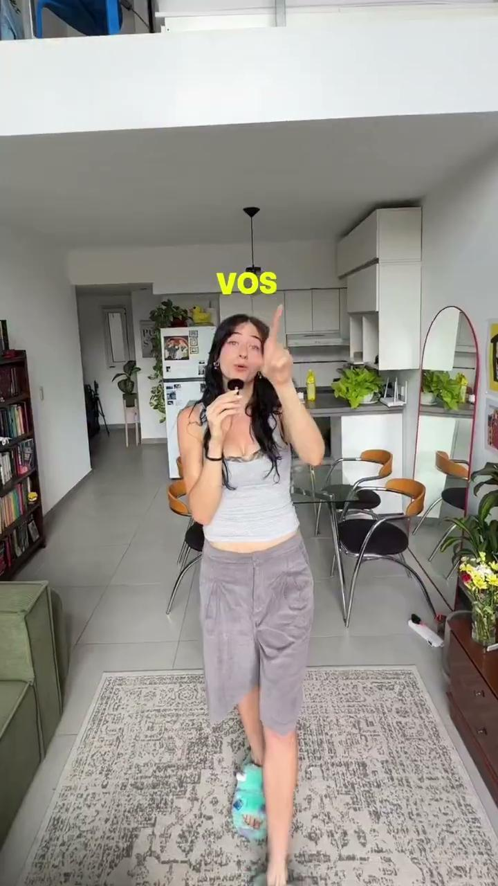

::: {.notes}
Usá herramientas de accesibilidad para ayudar a todo el mundo. Las notas de quien presenta son sólo un ejemplo de esto. Agrandá el cursor, usá keycaster para mostrar las teclas de control mientras escribís, cambiá al modo de alto contraste, todo ello ayuda a compensar un video que se corta por mala conexión a interntet o un video de mala calidad cuando tenés una pantalla de baja calidad.
wave.webaim.org/extension
grackledocs.com
:::

## Storytelling

1. Contar una historia conecta con **emociones**
2. No es sólo información
3. Ligado a nuestro objetivo
4. Puedo utilizar mi **experiencia**, mis emociones, experiencias de otros
5. Encontrar las **necesidades** de mi comunidad (pertinencia)

## El buen Storytelling

1. Me identifica
2. Despierta emociones
3. Hace sentir
4. Provoca la acción

## Ejemplo/Ejercicio {background-color="#C9DAF8"}

**La experiencia de los toallones**

💡 💡

:::: {.columns}
::: {.column width="33%"}
1. Si reutilizas las toallas, ayudas al medioambiente
:::
::: {.column width="33%"}
2.El 70% de los huéspedes del hotel, reutiliza las toallas
:::
::: {.column width="33%"}
3. El 70% de los huéspedes de esta habitación 204, reutiliza las toallas
:::
::::

**¿Qué cartel fue el más efectivo?**

## El buen Storytelling

1. Basado en los sentidos
2. Basado en la experiencia
3. Basado en la experiencia de otra persona
4. Es personal y cercano

**Sentir-Saber-Hacer**

## El buen Storytelling: Plantilla de Pixar

**Había una vez** un problema/situación...\
**Todos los días,** la gente o los científicos hacían...\
**Hasta que un día,** descubrimos/implementamos esto...\
**Debido a eso,** cambió la forma de...\
**Debido a eso,** logramos...\
**Finalmente,** el mundo/nuestro campo ahora es más...

## Cuerpo

:::: {.columns style="align-items:flex-start;"}
::: {.column width="25%"}

Cuerpo

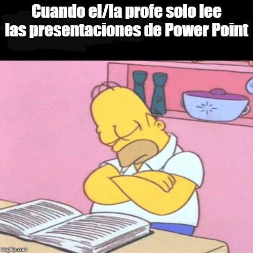
:::
::: {.column width="70%"}
1. ¿Qué herramientas necesito?
2. ¿Qué recursos voy a elegir?
3. ¿Cómo diseño el apoyo visual?

La audiencia **aprende mejor** con **elementos visuales***
:::
::::

## Cuerpo

:::: {.columns style="align-items:flex-start;"}
::: {.column width="25%"}

Cuerpo

:::
::: {.column width="70%"}
### Slides

No están diseñadas para contar todo
:::
::::

## Cuerpo

:::: {.columns style="align-items:flex-start;"}
::: {.column width="25%"}

Cuerpo

:::
::: {.column width="70%"}
### Slides

No están diseñadas para contar todo

- 1 slide = 1 concepto
:::
::::

## Cuerpo

:::: {.columns style="align-items:flex-start;"}
::: {.column width="25%"}

Cuerpo

:::
::: {.column width="70%"}
### Slides

No están diseñadas para contar todo

- 1 slide = 1 concepto
- Refuerzan la historia
:::
::::

## Cuerpo

:::: {.columns style="align-items:flex-start;"}
::: {.column width="25%"}

Cuerpo

:::
::: {.column width="70%"}
### Slides

No están diseñadas para contar todo

- 1 slide = 1 concepto
- Refuerzan la historia
- Son un complemento
:::
::::

## Cuerpo

:::: {.columns style="align-items:flex-start;"}
::: {.column width="25%"}

Cuerpo

:::
::: {.column width="70%"}
### Slides

No están diseñadas para contar todo

- 1 slide = 1 concepto
- Refuerzan la historia
- Son un complemento
- Sólo datos relevantes
:::
::::

## Cuerpo

:::: {.columns style="align-items:flex-start;"}
::: {.column width="25%"}

Cuerpo

:::
::: {.column width="70%"}
### Slides

No están diseñadas para contar todo

- 1 slide = 1 concepto
- Refuerzan la historia
- Son un complemento
- Sólo datos relevantes
- El texto debe ser limitado
:::
::::

## ¿Qué quiero que se lleven de mi charla?

:::: {.columns style="align-items:flex-start;"}
::: {.column width="25%"}

Cierre

:::
::: {.column width="70%"}
Es lo **último** que van a escuchar.\
Debe ser **potente**.
:::
::::

## ¿Qué quiero que se lleven de mi charla?

:::: {.columns style="align-items:flex-start;"}
::: {.column width="25%"}

Cierre

:::
::: {.column width="70%"}
- Un llamado a la acción
- Una frase motivadora/inspiradora
- Las dos
- Conclusión
- ¿Contacto?
:::
::::

## Armemos nuestra propia fórmula

:::: {.columns style="align-items:center;"}
::: {.column width="90%"}

IDEA<small>Objetivo</small>
+
Estructura
+
Oratoria

:::
::::

## Ejercicio 3: Oratoria {background-color="#F3F3F3"}

💡

Grabar un video de 1 minuto improvisando.\
Reproducirlo:

1. *Reproducir el video sólo con el audio sin mirarlo para escuchar mi lenguaje oral*
2. *Reproducir el video sin sonido para observar mis movimientos y mi lenguaje corporal*
3. *Desgrabar el texto de lo que dicen en el video para analizar el discurso.*

## Ejercicio 3: Grabando nuestro video {background-color="#F3F3F3"}

💡

:::: {.columns}
::: {.column width="55%"}
**Individual**:

<ol><li><em>Grabamos el video.</em></li></ol>

**En grupos:**

<ol start="2"><li><em>Compartimos el video.</em></li><li><em>Tomamos nota.</em></li></ol>

**Todos juntos:**

<ol start="4"><li><em>Reflexionamos</em></li></ol>
:::
::: {.column width="40%"}
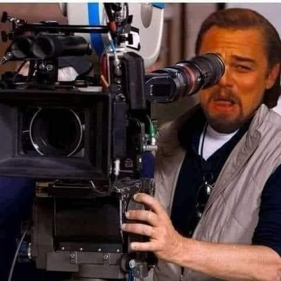
:::
::::

## Oratoria: el arte de hablar

Comunicación verbal + Comunicación no verbal

Todo lo que hago comunica

Postura: mirada, manos, caminar…

## Oratoria: el arte de hablar

Recursos: micrófono, escenario, pantalla

Ensayo: presencial o virtual

Ensayo del tiempo

**Práctica, práctica y más práctica**

## Oratoria: algunos tips

::: {style="font-size:0.85em;"}
No te aprendas la charla de memoria

La audiencia no sabe lo que le vas a contar. No tienen tu guión y no te está tomando examen

La charla puede ser más interesante para unas personas que para otras

Busca una cara amigable en el público

Y práctica, práctica, práctica porque es la mejor manera de sentir seguridad.
:::

## Armemos nuestra propia fórmula

:::: {.columns style="align-items:center;"}
::: {.column width="95%"}

IDEA<small>Objetivo</small>
+
Estructura
+
Oratoria

:::
::::

Practiquen con amigos y cronómetro

## [Caja de Herramientas](https://drive.google.com/drive/folders/1sBWKa_VMujrxQeZlQ3aKUMyI3rVsHwrN?usp=share_link) {background-color="#C9DAF8"}

💡

:::: {.columns}
::: {.column width="58%"}
1. [Guia de trabajo](https://zenodo.org/records/18404216)
2. [Guia para dar y recibir feedback](https://docs.google.com/document/d/1bz4dD1fRAG2CNHUTdI99G-aumK3TMAaylADyILnwrVI/edit?usp=share_link)
3. [Listado de herramientas digitales para armar charlas](https://zenodo.org/records/18395057).
4. [Listado de charlas con ejemplos diferentes de inicios y cierres](https://docs.google.com/document/d/1msF9KO0KJl4f1X4rRbLtiI1GgepF-8SX1xwsoUF7gDI/edit?usp=sharing).
:::
::: {.column width="35%"}
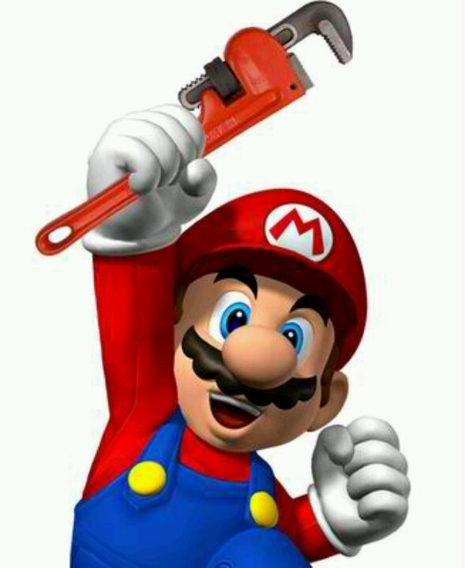
:::
::::

::: {.notes}
Usá herramientas de accesibilidad para ayudar a todo el mundo. Las notas de quien presenta son sólo un ejemplo de esto. Agrandá el cursor, usá keycaster para mostrar las teclas de control mientras escribís, cambiá al modo de alto contraste, todo ello ayuda a compensar un video que se corta por mala conexión a interntet o un video de mala calidad cuando tenés una pantalla de baja calidad.
wave.webaim.org/extension
grackledocs.com
:::

## {background-color="#A4C2F4"}

:::: {.columns style="align-items:center;"}
::: {.column width="55%"}
**Dudas**\
**Preguntas**

**Muchas gracias**

alejandra.bellini@gmail.com

::: {style="display:flex; align-items:center; gap:0.5em;"}
 alejandrabellini
:::

::: {style="display:flex; align-items:center; gap:0.5em;"}
 Alejandra Bellini
:::
:::
::: {.column width="40%"}
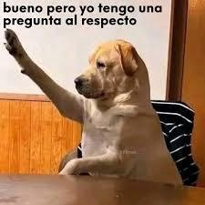
:::
::::

---

:::: {.columns style="align-items:center; margin-top:0.5em;"}
::: {.column width="58%"}
**Taller Programa de Campeon(a\|e)s**

Creando y dando una charla inolvidable

*De la idea a la acción*

**Alejandra Bellini**
:::
::: {.column width="38%"}

:::
::::

::: {style="display:flex; align-items:center; justify-content:space-between; margin-top:1em;"}

"Diseñado por pikisuperstar / Freepik"
:::

::: {.notes}
rcambio de saberes.
:::
