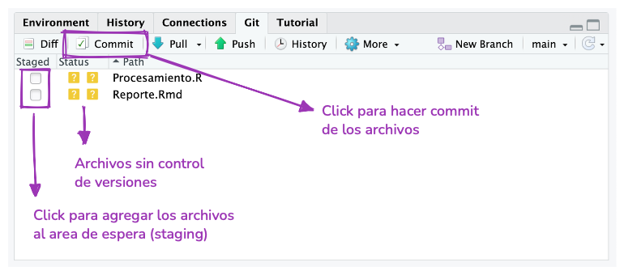
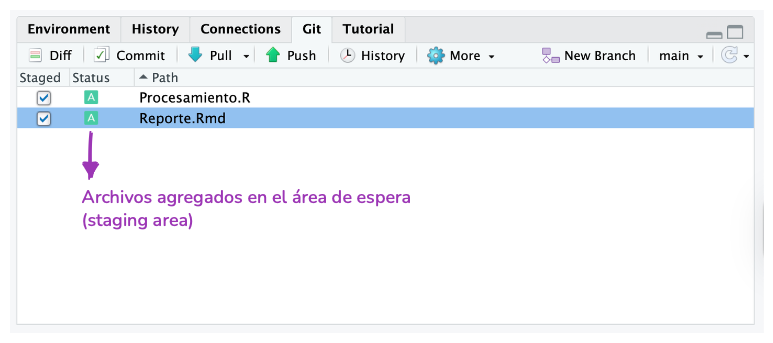
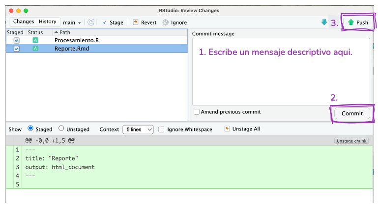

::: 
   {.callout-note} 
    
 

## Migração

Você está lendo a 
 **     primeira edição em andamento e em espanhol**    deste livro, baseada no currículo de formação do programa rOpenSci.

Este capítulo está sendo migrado dos materiais do currículo para o formato do livro e pode ainda não refletir a versão final do conteúdo.

*Conteúdo pendente de migração:*    consulte [     https://github.com/ropensci-training/git-developing-software-together](https://github.com/ropensci-training/git-developing-software-together) 
    
     e [     https://github.com/ropensci-training/git-desarrollo-software
](https://github.com/ropensci-training/git-desarrollo-software)    para o repositório-fonte deste capítulo.

:::

## Objetivos de aprendizagem

- Identificar por que o controle de versão, especificamente o Git, é importante para o desenvolvimento de software e a análise de dados.
- Diferenciar métodos para trabalhar com Git e R: integração com o RStudio e o usethis.
- Aplicar o processo de modificação-add-commit como fluxo de trabalho do Git para acompanhar as alterações e visualizar o histórico de commits de um repositório.
- Publicar repositórios no GitHub e sincronizar versões remotas e locais.

## Meus slides

```{=html}
<iframe src="git/slides/git_initial.html" 
        width="100%" 
        height="500px"
        style="border:none;">
</iframe>

```

## Por que o Git?

Você tem algo assim no seu computador?

```
/home/pao/Documents/Clases/progrmacion
├── script.R
├── tp.Rmd
├── tp_corregido.Rmd
├── tp_corregido2.Rmd
├── tp_final.Rmd
├── tp_finalfinal.Rmd
├── este_es_el_final.Rmd
├── juro_que_esta_es_la_ultima_version_del_tp.Rmd
└── FINAL.Rmd
```

Provavelmente todos nós temos, ou já tivemos algo assim em algum momento, porque precisamos salvar nosso trabalho, mas continuar tendo acesso às versões anteriores.
Existe uma solução para isso.
   Os sistemas de controle de versão gerenciam a evolução e as alterações de um conjunto de arquivos que chamaremos de **     repositório**   .
Se você já verificou o histórico de um arquivo do Google Docs, o controle de versões é semelhante, mas de uma forma muito mais controlada.
   O Git é um sistema de controle de versões muito popular, mas existem outros.

Se você trabalha sozinho, o Git é ótimo para acompanhar as alterações e recuperar versões anteriores dos seus arquivos.
   Você também pode usar um **     repositório remoto**    (que veremos mais adiante) para ter um backup e compartilhar seu trabalho.

Se você trabalha em equipe, pode aproveitar tudo isso e também usar o controle de versões como uma ferramenta para colaborar e organizar as diferentes versões de um mesmo arquivo presentes nos diversos computadores que você e as outras pessoas utilizam.

## Mas o que entendemos por controle de versões?

Imaginemos que temos um repositório em funcionamento ([     mais adiante](04-git-1/#crear-un-nuevo-repositorio)    veremos como criar um).
   Quando você cria um novo arquivo como parte do repositório (ou *     repo*), esse arquivo inicialmente não é 
 **     rastreado**    nem **     está versionado**   .
Isso significa que o git ignorará o arquivo e quaisquer alterações que você tenha feito até que **o *     adicione*    ao repositório (*     add*    em inglês) e comece a registrar as alterações feitas no conteúdo.
Nesse momento, o arquivo está na área 
 **     staging**    (que podemos imaginar como uma sala de espera do Git) e está pronto para entrar no repositório.
   Para isso, é preciso *     confirmar* 
    
     ou registrar (*     commit*    em inglês) essa versão do arquivo no repositório.

   Esse fluxo de trabalho 
   `modify --> add --> commit`    se repetirá toda vez que você quiser salvar uma versão do arquivo.

::: dica
   Não recomendamos fazer um *     commit*    toda vez que você salvar o arquivo ou alterar uma vírgula, e também não é uma boa ideia fazer um *     commit*    com um bilhão de alterações.
Com a prática e dependendo de como você trabalha, você encontrará um equilíbrio confortável.
   :::


Mencionamos as ações 
 `add`    e 
 `commit` que são os nomes de dois comandos do Git.
Se você tem experiência em trabalhar com o terminal, pode usar o Git por lá, mas os mesmos comandos podem ser executados a partir de uma interface gráfica, como [     GitHub Desktop](https://desktop.github.com/)    ou [     GitKraken](https://www.gitkraken.com/)   .
Durante este curso, usaremos o RStudio.

## Já mencionamos “repositório remoto”?

Antes, revisamos o 
 **     fluxo de trabalho local**   .
   O repositório (uma pasta oculta chamada 
 `.git`   ) fica no seu computador e, com isso, você já está usando controle de versão.
Mas você também pode conectar o **     repositório local**    a um **     repositório remoto**   .

    Neste curso, vamos usar o [     GitHub](https://www.github.com) 
    
     para hospedar repositórios remotos, mas há outras opções que você pode explorar, como [     GitLab](https://about.gitlab.com/)    ou [     Codeberg](https://codeberg.org)   .

Se você usar um repositório remoto, precisará adicionar mais uma etapa ao fluxo de trabalho local (`modify --> add --> commit`   ) para garantir que a cópia do repositório no seu computador seja a mesma que a cópia no GitHub e vice-versa.

Em seguida, outra pessoa da sua equipe faz uma alteração em um arquivo no repositório local dela e a envia para o repositório remoto.
Agora, seu repositório local está “desatualizado” e você precisa baixar esses novos commits do repositório remoto para o seu computador.
   Você precisa fazer 
 **     pull**   .

Se, em seguida, outra pessoa da sua equipe fizer uma alteração em um arquivo no repositório local dela e a enviar para o repositório remoto.
   Agora, seu repositório local está “desatualizado” em relação ao repositório remoto.
Você precisa baixar esses novos commits do repositório remoto para o seu computador.
   Você precisa fazer **um**
 **     pull**   .


Ferramentas como o GitHub também incluem recursos que ajudam você a colaborar e gerenciar repositórios.
   Por exemplo, você pode modificar arquivos e fazer 
 *     commits*    com essas alterações usando a interface da web.

## Configuração inicial

Antes de criar seu primeiro repositório, é importante verificar se o Git está configurado corretamente no seu computador e se você tem permissões para fazer alterações no GitHub.
Se você seguiu as 
 [     instruções pré-curso](preparacion.html)   , tudo já deve estar pronto, mas podemos verificar a situação com 
 `usethis::git_sitrep()` 
     para ter certeza.

```r
> usethis::git_sitrep()

── Git global (user) 
• Name: "Pao Corrales"
• Email: "micorreo@gmail.com"
• Global (user-level) gitignore file: ~/.gitignore
• Vaccinated: TRUE
• Default Git protocol: "https"
• Default initial branch name: "main"

── GitHub user 
• Default GitHub host: "https://github.com"
• Personal access token for "https://github.com": <discovered>
• GitHub user: "paocorrales"
• Token scopes: "gist", "repo", "user", and "workflow"
• Email(s): "micorreo@gmail.com (primary)", "paocorrales@users.noreply.github.com", and
  "otro correo@gmail.com"
ℹ No active usethis project.
```

Verifique se as informações estão corretas e se 
 `Personal access token for "https://github.com":`    é igual a 
   `<discovered>`   .
   Isso garantirá que você possa trabalhar com o Git e o GitHub.
Se você notar alguma diferença, é útil revisar as instruções de instalação em “[     O que você precisa fazer antes do curso](preparacion.html)   ”.

## Novo repositório

### Primeiro o repositório no GitHub, depois o projeto no RStudio

Existem várias maneiras de criar um novo repositório: localmente no seu computador usando o terminal, pelo GitHub (ou plataformas semelhantes) ou pelo RStudio!
Aqui, vamos mostrar como criar um repositório no GitHub, associá-lo a um projeto do RStudio e trabalhar com ele.
   Mas lembre-se de que há muitas outras maneiras de trabalhar com o Git.

::: exercício
**     1. Crie um repositório online.**

- Acesse 
 [         github.com](https://github.com)        e faça login.
- No canto superior direito, clique no botão “+” e, em seguida, em “New repository”.

Em seguida, preencha as informações do repositório:

- Modelo do repositório: Sem modelo.
- Nome do repositório: o nome que você quiser dar ao seu novo projeto.
- Descrição: Uma breve descrição do projeto. Escreva de forma que as pessoas entendam.
- Visibilidade: Pública.
- Inicializar este repositório com: nada (podemos configurar tudo a partir do R).

Antes de voltar ao RStudio, copie a URL do repositório.
   Por exemplo 
   `https://github.com/paocorrales/myrepo.git`
 

Você já tem seu repositório local!
   :::

::: exercício
**     2. No RStudio, inicie um novo projeto:**

- `File > New Project > Version Control > Git`. No campo “URL do repositório”, cole a URL do seu novo repositório do GitHub; ela deve ter este formato: 
 `https://github.com/paocorrales/myrepo.git`       .
- Escolha a pasta no seu disco onde deseja criar o projeto.
- Selecione “Abrir em nova sessão”.
- E clique em “Create project”.
         :::

A nova pasta no seu computador será um repositório Git, vinculado a um repositório remoto do GitHub e a um projeto do RStudio ao mesmo tempo.
   Esse fluxo de trabalho também garante que toda a configuração entre os repositórios local e remoto seja realizada corretamente.

Além disso, ele adiciona um arquivo chamado 
 `.gitignore`    que inclui uma lista de arquivos que não queremos incluir no repositório (por exemplo, 
 `.Rhistory`   ).

### Primeiro, o projeto no RStudio; depois, o repositório no GitHub

Suponhamos que você já tenha um projeto existente no RStudio e, agora que conhece todas as vantagens do controle de versão, queira começar a usá-lo.

Podemos usar o pacote 
 *     usethis*    para nos ajudar a iniciar o controle de versão desse projeto.

Para isso, primeiro você precisa se certificar de que o projeto já seja um repositório Git. Se você tiver a aba “Git” no RStudio, então seu projeto já é um repositório Git. Caso contrário, você pode usar a função 
   `usethis::use_git()` 
     para inicializá-lo como um repositório Git.

```r
> usethis::use_git()

✔ Setting active project to "/Users/yabellini/Documents/GitHub/ControlDeVersiones".
✔ Initialising Git repo.
✔ Adding ".Rproj.user", ".Rhistory", ".Rdata", ".httr-oauth", ".DS_Store", and ".quarto" to
  .gitignore.
ℹ There are 2 uncommitted files:
• .gitignore
• ControlDeVersiones.Rproj
! Is it ok to commit them?

1: Not now
2: Negative
3: Yes

```

Ao selecionarmos a opção afirmativa, será exibida uma mensagem como a seguinte:

```r
✔ Adding files.
✔ Making a commit with message "Initial commit".
A restart of RStudio is required to activate the Git pane.
Restart now?

1: Not now
2: Nope
3: Yeah
```

O próximo passo é associar o repositório local a um repositório remoto no GitHub. Para isso, utiliza-se a função 
 `usethis::use_github()`   .

```r
> usethis::use_github()

ℹ Defaulting to "https" Git protocol.
✔ Setting active project to "/Users/yabellini/Documents/GitHub/ControlDeVersiones".
✔ Creating GitHub repository "yabellini/ControlDeVersiones".
✔ Setting remote "origin" to "https://github.com/yabellini/ControlDeVersiones.git".
✔ Pushing "main" branch to GitHub and setting "origin/main" as upstream branch.
✔ Opening URL <https://github.com/yabellini/ControlDeVersiones>.

```

Essa função recebe um projeto local e realiza uma série de verificações e ações, entre as quais estão:

- Verificar se o projeto já é um repositório Git.

- Verificar se o branch atual é o branch padrão, por exemplo, 
 *         main*       .

- Verificar se não há nenhum origin remoto pré-existente.

- Criar um repositório associado no GitHub.

- Adicionar esse repositório do GitHub ao seu repositório local como origem remota.

- Faça um 
 *         push*        inicial para o GitHub para sincronizar os repositórios.

## Alterações locais

É hora de colocar em prática algumas das coisas sobre as quais temos falado.

::: exercício
**     Adicionar, fazer commit**

1. Crie um novo arquivo RMarkdown e salve-o.
2. Adicione-o à área de preparação com *         add*        e, em seguida, faça um *         commit*       . Você vai ter que pensar em uma mensagem descritiva!
3. Faça uma alteração no arquivo, pode ser qualquer coisa. Salve-o.
4. Repita a etapa 2.






   :::

Se tudo correu bem, você começou a rastrear arquivos, fez alterações e commits para salvar essa versão no repositório local.
   Você pode ver uma mensagem na aba do Git informando que o repositório local “está à frente de 'origin/master' em 2 commits”.
Você não verá nenhuma alteração no GitHub até fazer 
 **     push**    e enviar esses commits para o repositório remoto.
Você pode fazer isso no final do dia, se preferir, mas se trabalhar com outras pessoas, pode ser uma boa ideia fazer *     push*    após cada *     commit*   .

::: exercício
**     Faça o \`push\`!**

1. Agora, faça 
 *         push*        para enviar os commits para o repositório remoto usando o botão com a seta verde apontando para cima.
         :::

## Alterações remotas

Vamos voltar ao GitHub.
   Se você atualizar a página, agora verá os arquivos que acabou de adicionar ao repositório ou modificar.
Vamos clicar em “Commits” para ver o histórico do repositório.
   Nesta página, você pode explorar o repositório no “estado” em que se encontrava a cada commit e ver as diferenças entre as diversas versões.

Agora, podemos tentar fazer alterações aqui.

::: exercício
**     Crie um README**

1. Na página inicial, clique no botão verde que diz “Add a README”.
2. Adicione algo ao arquivo. Os arquivos README geralmente são escritos em Markdown e contêm informações sobre o repositório.
3. No final da página, adicionei uma mensagem e cliquei em “Confirm changes...”.
4. Volte à página inicial para ver o README.
         :::

O novo arquivo e as alterações que você fizer no GitHub só estarão no repositório remoto até que você faça um 
 **     pull**    no repositório local.
Se você fizer alterações no repositório local enquanto ele não estiver atualizado, poderá encontrar conflitos ao tentar mesclar as duas versões, o que costuma causar dores de cabeça.
   Isso ocorre quando a versão de um arquivo no repositório local não é compatível com a versão no repositório remoto.
Nesses casos, o git não consegue decidir qual versão está correta e você precisa fazer essa escolha.

Para evitar esse problema (na medida do possível), você deve fazer um pull antes de começar a fazer qualquer outra coisa.

    Na maioria das vezes, o RStudio exibirá a mensagem “Already up to date”, mas é bom tornar isso um hábito.

::: exercício
**     Fazer pull do GitHub**

1. Volte ao RStudio.
2. Verifique o painel do Git.
3. Clique na seta azul que diz “Pull”.
4. Verifique o arquivo README na aba Arquivos.
         :::

## Anatomia de um repositório do GitHub

- *Arquivos README.*        Use um 
       `README.md`        para explicar do que se trata seu projeto e como utilizá-lo.
  `README.md`        é o arquivo exibido automaticamente quando você abre um repositório do GitHub.

- *Licença.*        A licença informa às pessoas como elas podem utilizar o conteúdo do seu repositório.
  
        Geralmente, usamos licenças permissivas para que as pessoas possam utilizar os materiais da maneira que quiserem.
  Alguns exemplos são a Licença MIT ou a Apache.
         Você pode conferir alguns recursos adicionais:
  
  - [Escolha uma licença para projetos de código](https://choosealicense.com/)           .
  - [Licenças de software em linguagem simples](https://tldrlegal.com/)           : explica o jargão jurídico das licenças em termos simples

- *Guia para colaborar.*        Um arquivo chamado 
       `CONTRIBUTING.md`        que inclui instruções para que as pessoas que desejam colaborar no seu projeto saibam o que devem fazer se quiserem ajudá-lo.

- *Código de conduta.*        Bons projetos têm códigos de conduta para garantir um ambiente acolhedor onde as pessoas possam colaborar.
         O GitHub oferece atalhos para adicionar um Código de Conduta facilmente.

- *Issues.*        Eles permitem que você gerencie o projeto, discuta problemas e melhorias com outras pessoas.

::: callout-tip

## Mais detalhes

Nas oficinas de Desenvolvimento de Pacotes em R, veremos como adicionar todas essas partes do repositório no R, com foco em um pacote de R.
   :::


