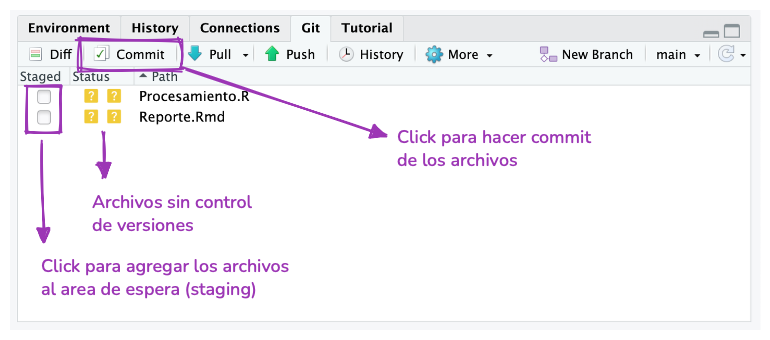
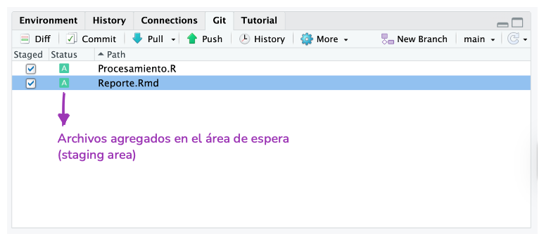
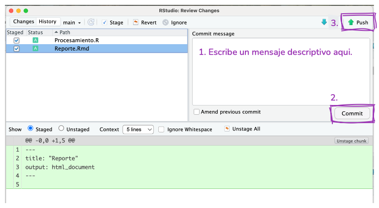

::: {.callout-note}
## Migración

Estás leyendo la **primera edición en progreso y en castellano** de este libro, basada en el currículum de formación del programa de rOpenSci. 

Este capítulo está siendo migrado desde los materiales del currículum al formato del libro y puede no reflejar todavía la versión final del contenido.

*Contenido pendiente de migración:* ver https://github.com/ropensci-training/git-developing-software-together y https://github.com/ropensci-training/git-desarrollo-software para el repo fuente de este capítulo.

:::


## Objetivos de aprendizaje

-   Identificar por qué el control de versiones, específicamente Git, es importante para el desarrollo de software y análisis de datos.
-   Diferenciar métodos para trabajar con Git y R: integración con RStudio y usethis.
-   Aplicar el proceso de modificación-add-commit como el flujo de trabajo de Git para el seguimiento de los cambios y ver el historial de commits de un repositorio.
-   Publicar repositorios en GitHub y coordinar versiones remotas y locales.

## ¿Por qué git?

¿Tenés algo así en tu computadora?

```         
/home/pao/Documents/Clases/progrmacion
├── script.R
├── tp.Rmd
├── tp_corregido.Rmd
├── tp_corregido2.Rmd
├── tp_final.Rmd
├── tp_finalfinal.Rmd
├── este_es_el_final.Rmd
├── juro_que_esta_es_la_ultima_version_del_tp.Rmd
└── FINAL.Rmd
```

Probablemente todas las personas lo tenemos, o tuvimos algo así en algún momento, porque necesitamos guardar nuestro trabajo pero seguir teniendo acceso a versiones anteriores.
Existe una solución para esto.
Los sistemas de control de versiones gestionan la evolución y los cambios de un conjunto de archivos que llamaremos **repositorio**.
Si alguna vez revisaste el historial de un archivo de Google Docs, el control de versiones es similar pero de una forma muy controlada.
Git es un sistema de control de versiones muy popular, pero hay otros.

Si trabajas de manera individual, git es genial para hacer un seguimiento de los cambios y recuperar versiones anteriores de tus archivos.
También podés utilizar un **repositorio remoto** (que veremos más adelante) para tener una copia de seguridad y compartir tu trabajo.

Si trabajas en equipo, podés aprovechar todo lo anterior y utilizar también el control de versiones como herramienta para colaborar y organizar las distintas versiones de un mismo archivo presentes en las múltiples computadoras que vos y las otras personas usen.

## Pero, ¿qué entendemos por control de versiones?

Imaginemos que tenemos un repositorio funcionando ([más adelante](04-git-1/#crear-un-nuevo-repositorio) veremos cómo crear uno).
Cuando creas un nuevo archivo como parte del repositorio (o *repo*), ese archivo inicialmente no es **trackeado/rastreado** o **no está versionado**.
Esto significa que git ignorará el archivo y cualquier cambio que hayas hecho hasta que lo *agregues* al repositorio (*add* en inglés) y empieces a registrar los cambios que hagas en el contenido.
En ese momento el archivo está en el area **staging** (que podemos imagina como una sala de espera de git) y está listo para entrar en el repositorio.
Para eso hay que *confirmar* o registrar (*commit* en inglés) esa versión del archivo en el repositorio.
Este flujo de trabajo `modify --> add --> commit` se repetirá cada vez que quieras guardar una versión del archivo.

::: tip
No recomendamos hacer un *commit* cada vez que guardes el archivo o cambies una coma, y tampoco es buena idea hacer un *commit* con mil millones de cambios.
Con la práctica y dependiendo de cómo trabajes, encontrarás un punto medio cómodo.
:::


Mencionamos las acciones `add` y `commit` que son los nombres de dos comandos de git.
Si tenes experiencia trabajando con la terminal podés utilizar git desde ahí, pero los mismos comandos pueden ejecutarse desde una GUI como [GitHub Desktop](https://desktop.github.com/) o [GitKraken](https://www.gitkraken.com/).
Durante este curso utilizaremos RStudio.

## ¿Ya mencionamos "repositorio remoto"?

Antes revisamos el **flujo de trabajo local**.
El repositorio (una carpeta oculta llamada `.git`) vive en tu computadora y con eso ya estas usando control de versiones.
Pero, también podrías conectar el **repositorio local** con un **repositorio remoto**.
En este curso vamos a utilizar [GitHub](https://www.github.com) para alojar repositorios remotos, pero hay otras opciones que podrías explorar, como [GitLab](https://about.gitlab.com/) o [Codeberg](https://codeberg.org).

Si usas un repositorio remoto, tendrás que agregar un paso más al flujo de trabajo local (`modify --> add --> commit`) para asegurarte que la copia del repositorio en tu computadora es la misma que la copia en GitHub y vise versa.

Luego, otra persona de tu equipo hace un cambio en un archivo en su repositorio local y lo sube al repositorio remoto.
Ahora, tu repositorio local está "desactualizado" y necesitas descargar esos nuevos commits del repositorio remoto a tu computadora.
Necesitas hacer **pull**.

Si luego, otra persona de tu equipo hace un cambio en un archivo en su repositorio local y lo sube al repositorio remoto.
Ahora, tu repositorio local está "desactualizado" respecto del repositorio remoto.
Necesitas descargar esos nuevos commits del repositorio remoto a tu computadora.
Necesitas hacer **pull**.


Herramientas como GitHub también incluyen funciones que te ayudan a colaborar y gestionar repositorios.
Por ejemplo, puedes modificar archivos y hacer *commits* con esos cambios utilizando la interfaz web.

## Configuración inicial

Antes de crear tu primer repositorio es importante revisar que git esté configurado correctamente en tu computadora y que tengas permisos para modificar cosas en GitHub.
Si seguiste las instrucciones [instrucciones previas al curso](preparacion.html) deberías tener todo listo, pero podemos revisar el estado de situación con `usethis::git_sitrep()` para comprobarlo.

``` r
> usethis::git_sitrep()

── Git global (user) 
• Name: "Pao Corrales"
• Email: "micorreo@gmail.com"
• Global (user-level) gitignore file: ~/.gitignore
• Vaccinated: TRUE
• Default Git protocol: "https"
• Default initial branch name: "main"

── GitHub user 
• Default GitHub host: "https://github.com"
• Personal access token for "https://github.com": <discovered>
• GitHub user: "paocorrales"
• Token scopes: "gist", "repo", "user", and "workflow"
• Email(s): "micorreo@gmail.com (primary)", "paocorrales@users.noreply.github.com", and
  "otro correo@gmail.com"
ℹ No active usethis project.
```

Revisá que la información sea correcta y que `Personal access token for "https://github.com":` sea igual a `<discovered>`.
Eso te garantizará que puedas trabajar con git y GitHub.
Si vez alguna diferencia, es útil revisar las instrucciones de instalación en "[Lo que necesitas hacer antes del curso](preparacion.html)".

## Nuevo repositorio

### GitHub repo primero, proyecto de RStudio despues

Hay muchas formas de iniciar un nuevo repositorio, localmente en tu computadora utilizando la terminal, desde GitHub (o sus amigos) ¡o desde RStudio!.
Aca te mostraremos cómo crear un repositorio desde GitHub, asociarlo a un proyecto de RStudio y trabajar con él.
Pero tené en cuenta que hay muchas otras formas de trabajar con git.

::: ejercicio
**1. Creá un repositorio online.**

-   Entrá en [github.com](https://github.com) e inicia sesión.
-   En la esquina superior derecha, hacé click en el botón "+" y luego en "New repository".

A continuación completá la información del repositorio:

-   Repository template: No template.
-   Repository name: como quieras llamar a tu nuevo proyecto.
-   Description: Una descripción breve del proyecto. Escribila para que la entiendan personas.
-   Visibilidad: Public.
-   Initialize this repository with: nada (podemos configurarlo todo desde R).

Antes de volver a RStudio, copia la url del repositorio.
Por ejemplo `https://github.com/paocorrales/myrepo.git`

Ya tenés tu repositorio local!
:::

::: ejercicio
**2. En RStudio, inicia un nuevo Proyecto:**

-   `File > New Project > Version Control > Git`. En la "URL del repositorio" pegá la URL de tu nuevo repositorio de GitHub, tiene que tener esta pinta: `https://github.com/paocorrales/myrepo.git`.
-   Elejí la carpeta en tu disco donde querés crear el proyecto.
-   Elejí "Open in new sesion".
-   Y hacé clic en "Create project".
:::

La nueva carpeta en tu computadora será un repositorio git, vinculado a un repositorio remoto de GitHub y un proyecto de RStudio al mismo tiempo.
Este flujo de trabajo también se asegura de que toda la configuración entre los repositorios local y remoto se realice correctamente.

También agrega un archivo llamado `.gitignore` que incluye una lista de archivos que no queremos sumar al repositorio (por ejemplo `.Rhistory`).

### Proyecto de RStudio primero, repositorio de GitHub después

Supongamos que ya tenes un proyecto de RStudio existente y ahora que conoces todas las bondades del control de versiones queres empezar a usarlo. 

Podemos utilizar el paquete _usethis_ para que nos ayude a empezar a versionar ese proyecto. 

Para eso, primero tenes que asegurarte de que el proyecto ya sea un repositorio git.  Si tenes el tab de Git en RStudio entonces tu proyecto ya es un repositorio git. Si no lo es, podes usar la funcion `usethis::use_git()` para inicializarlo como un repositorio git.

``` r
> usethis::use_git()

✔ Setting active project to "/Users/yabellini/Documents/GitHub/ControlDeVersiones".
✔ Initialising Git repo.
✔ Adding ".Rproj.user", ".Rhistory", ".Rdata", ".httr-oauth", ".DS_Store", and ".quarto" to
  .gitignore.
ℹ There are 2 uncommitted files:
• .gitignore
• ControlDeVersiones.Rproj
! Is it ok to commit them?

1: Not now
2: Negative
3: Yes

```
Cuando elegimos la opcion afirmativa nos mostrara un mensaje como el siguiente:

``` r
✔ Adding files.
✔ Making a commit with message "Initial commit".
A restart of RStudio is required to activate the Git pane.
Restart now?

1: Not now
2: Nope
3: Yeah
```


El siguiente paso es asociar el repositorio local con un repositorio remoto en GitHub. Para eso se usa la funcion `usethis::use_github()`.

``` r
> usethis::use_github()

ℹ Defaulting to "https" Git protocol.
✔ Setting active project to "/Users/yabellini/Documents/GitHub/ControlDeVersiones".
✔ Creating GitHub repository "yabellini/ControlDeVersiones".
✔ Setting remote "origin" to "https://github.com/yabellini/ControlDeVersiones.git".
✔ Pushing "main" branch to GitHub and setting "origin/main" as upstream branch.
✔ Opening URL <https://github.com/yabellini/ControlDeVersiones>.

```

Esta funcion toma un proyecto local y realiza una serie de chequeos y acciones, entre las cuales se encuentran:

- Verificar que el proyecto ya es un repositorio Git.

- Chequear que la rama actual es la rama predeterminada, por ejemplo, _main_.

- Verificar que no hay ningún origen remoto preexistente.

- Crear un repositorio asociado en GitHub.

- Añadir ese repositorio de GitHub a tu repositorio local como origen remoto.

- Realiza un _push_ inicial a GitHub para sincronizar repos.


## Cambios locales

Es hora de poner en práctica algunas de las cosas de las que hemos estado hablando.

::: ejercicio
**Add, commit**

1.  Creá un nuevo archivo RMarkdown y guardalo.
2.  Agregalo al área de preparación con *add* y luego hace un *commit*. ¡Vas a tener que pensar un mensaje descriptivo!
3.  Hace un cambio en el archivo, puede ser cualquier cosa. Guardalo.
4.  Repetí el paso 2.






:::

Si todo salió bien, empezaste a rastrear archivos, hiciste cambios y commits para guardar esa versión en el repositorio local.
Puede que veas un mensaje en la pestaña de git diciendo que el repositorio local "is ahead of 'origin/master\` by 2 commits".
No verás ningún cambio en GitHub hasta que hagas **push** y envíes esos commits al repositorio remoto.
Podés hacer esto al final del día si preferis, pero si trabajas con otras personas puede ser una buena idea hacer *push* luego de cada *commit*.

::: ejercicio
**¡Push!**

1.  Ahora, hacé *push* para enviar los commits al repositorio remoto utilizando el botón con la flecha verde apuntando hacia arriba.
:::

## Cambios remotos

Volvamos a GitHub.
Si actualizas la página, ahora verás los archivos que acabas sumar al repositorio o modificar.
Hagamos click en "Commits" para ver la historia del repositorio.
Desde esta página, podés explorar el repositorio en el "estado" en el que estaba con cada commit y ver las diferencias entre las distintas versiones.

Ahora, podemos intentar hacer cambios aquí.

::: ejercicio
**Crear un README**

1.  En la página principal, hacé click en el botón verde que dice "Add a README".
2.  Agregá algo en el archivo. Los README suelen estar escritos en Markdown y contienen información sobre el repositorio.
3.  Al final de la página añadí un mensaje y hacé click en "Confirm changes...".
4.  Volvé a la página principal para ver el README.
:::

El nuevo archivo y los cambios que hagas en GitHub sólo estarán en el repositorio remoto hasta que hagas un **pull** en el repositorio local.
Si realizas cambios en el repositorio local mientras no está actualizado, podés encontrarte con conflictos cuando intentes unir las 2 versiones, lo que suele generar dolores de cabeza.
Esto ocurre cuando la versión de un archivo en el repositorio local no es compatible con su versión en el repositorio remoto.
En esos casos, git no puede decidir qué versión es la correcta y tenés que hacerlo vos.

Para evitar este problema (lo más posible), tenes que hacer un pull antes de empezar a hacer cualquier otra cosa.
La mayoría de las veces RStudio mostrará el mensaje "Already up to date", pero es bueno hacerlo un hábito.

::: ejercicio
**Pull desde GitHub**

1.  Volvé a RStudio.
2.  Revisá panel de Git.
3.  Hacé click en la flecha azul que dice "Pull".
4.  Revisá el archivo README en la pestaña Archivos.
:::

## Anatomía de un repositorio de GitHub

-   *Archivos README.* Utilizá un `README.md` para explicar de que se trata es tu proyecto y cómo utilizarlo.
    `README.md` es el archivo que se muestra automáticamente cuando abrís un repositorio de GitHub.

-   *Licencia.* La licencia le indica a las personas cómo puede utilizar el contenido de tu repositorio.
    Generalmente, utilizamos licencias permisivas para que las personas pueda utilizar los materiales de cualquier manera.
    Algunos ejemplos son la Licencia MIT o Apache.
    Podés revisar algunos recursos extra:

    -   [Elejí una licencia para proyectos de código](https://choosealicense.com/).
    -   [Licencias de software en lenguaje sencillo](https://tldrlegal.com/): explica la jerga legal de las licencias en términos sencillos

-   *Guía para colaborar.* Un archivo llamado `CONTRIBUTING.md` que incluye las instrucciones que personas que quieren conlaborar en tu proyecto sepan lo que deben hacer si quieren ayudarte.

-   *Código de conducta.* Los buenos proyectos tienen códigos de conducta para garantizar un ambiente amigable donde las personas pueden colaborar.
    Github tiene atajos para agregar Código de Conducta facilmente.

-   *Issues.* Te permiten gestionar el proyecto, discutir problemas y mejoras con otras personas.

::: callout-tip
## Mas detalle

En los talleres de Desarrollo de Paquetes de R veremos como agregar todas estas partes del repositorio en R y con foco en un paquete de R.
:::
