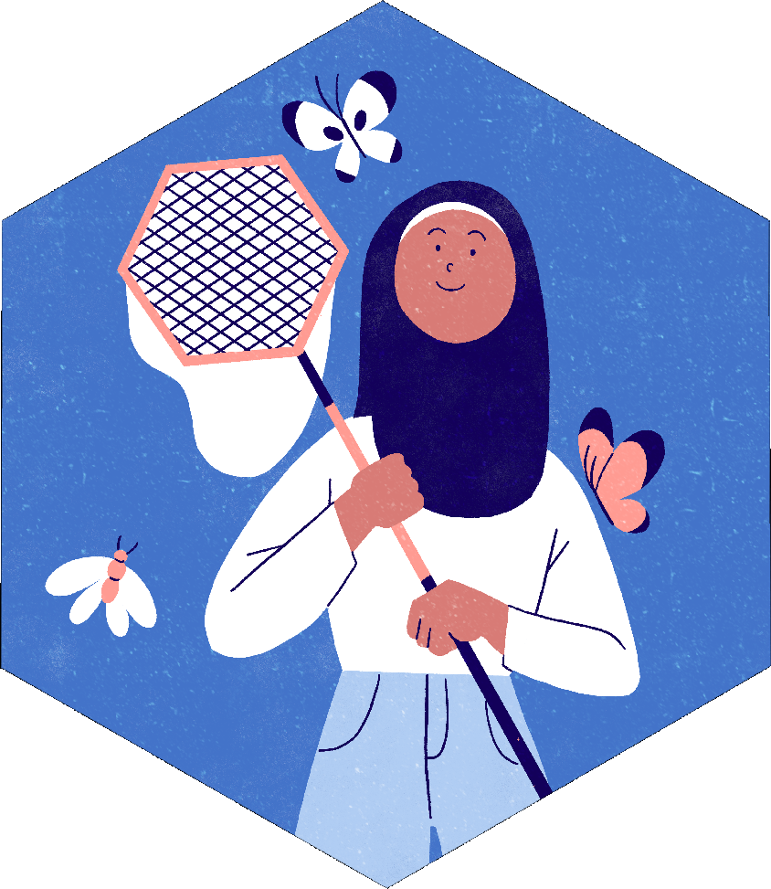
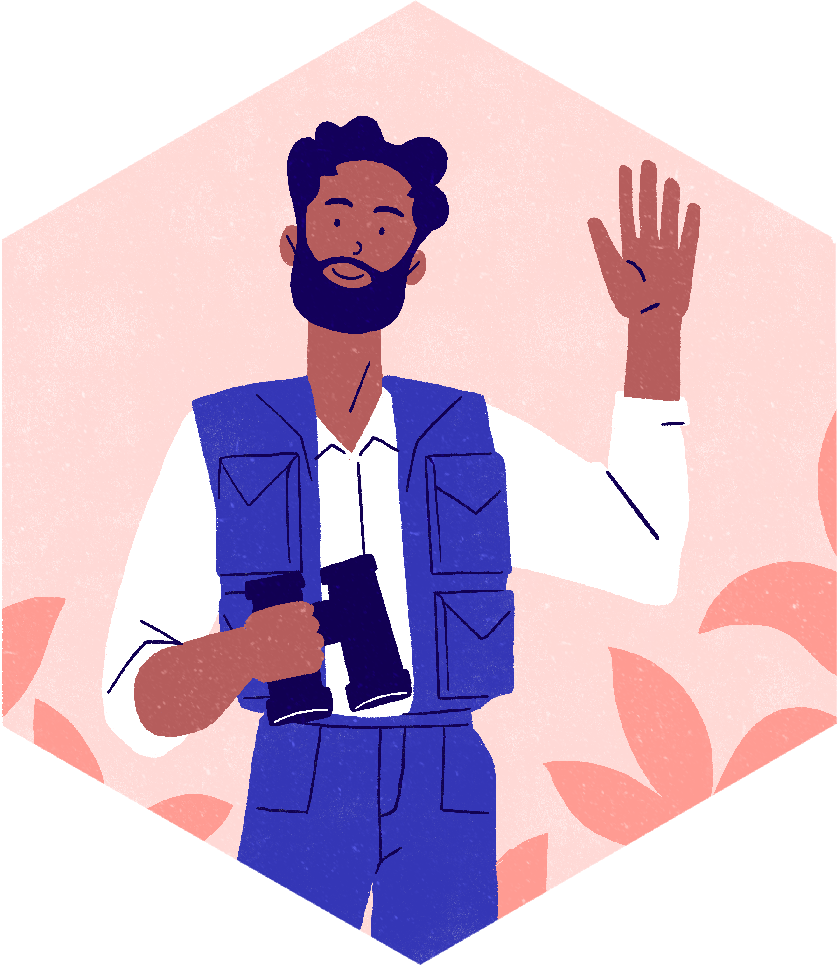
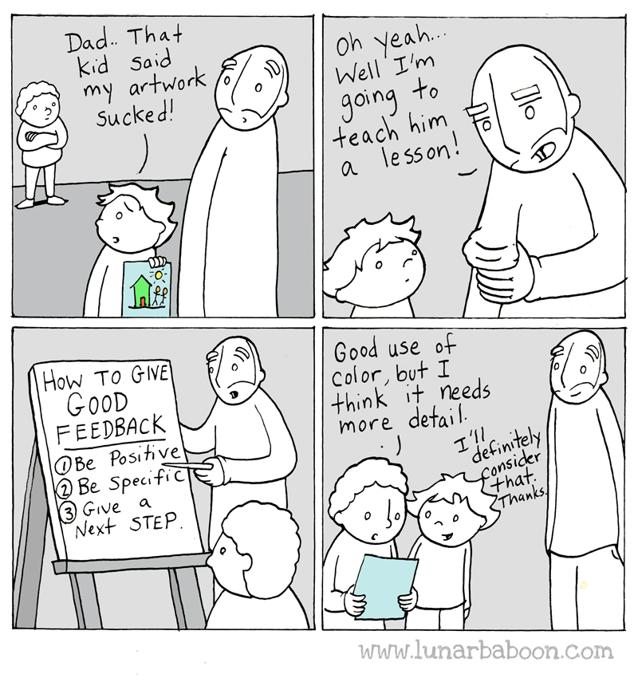

::: {style="text-align:center; margin-bottom:0;"}
*rOpenSci*\
**Mentoring & training program for Scientific Open Source Champions**
:::

::: {style="text-align:center; margin-top:0.3em;"}
**Mentorship Training and Orientation**

Moderated by **Yani Bellini Saibene**
:::

::: {style="display:flex; align-items:center; gap:1em; margin-top:2em;"}

**Source materials: Mozilla Open Leaders, The Carpentries & Teaching Tech Together - CC-BY-NC**
:::

::: {.notes}
Ask for permission to record
:::

---

## Mentorship Reflection {background-color="#447BCD"}

:::: {.columns}
::: {.column width="58%"}
**Duration:** ~10 minutes

- Think of an experience you've had as a mentor or being mentored
- Use the shared doc to answer the questions next to your name
:::
::: {.column width="35%"}

:::
::::

::: {.notes}
what was that relationship like? how did it help you-- how were things different for you because of that relationship?
what is one thing your mentor said/did that was helpful?
What went well / what was helpful?
What didn't work?
Think of a problem you'd like mentoring on right now
:::

## What do mentors do?

:::: {.columns}
::: {.column width="30%"}

:::
::: {.column width="68%"}
Mentors **advise** and **inspire.**

- **Recommend** resources, readings, training, experiences
- **Feedback** to consider
- **Connect** to people, programs, and organizations
:::
::::

## Mentorship Skills

overview of the skills we'll see today

:::: {.columns}
::: {.column width="30%"}

:::
::: {.column width="68%" style="text-align:center; font-size:1.3em; margin-top:1.5em;"}
Active Listening\
Effective Questioning\
Giving Feedback
:::
::::

## Mentorship Skills - Active Listening

:::: {.columns}
::: {.column width="30%"}

:::
::: {.column width="68%"}
- Suspend judgment and listen.
- Give your full attention to the speaker (don't rehearse what you're going to say).
- Encourage the speaker with verbal and nonverbal cues.
:::
::::

::: {.notes}
What is active listening?
How active listening looks like?

Active listening: people make good and insightful questions. You can iterate on what they said.
:::

## Mentorship Skills - Effective Questioning

:::: {.columns}
::: {.column width="30%"}

:::
::: {.column width="68%"}
- Access & analyze information
- Stimulate thinking & creativity
- Learn through discussion
:::
::::

::: {.notes}
Why questions are important in mentoring?

Questions let us: they also help to clarify understanding, give an outline of the discussion, prompt creativity.
:::

## Mentorship Skills - Giving Feedback

:::: {.columns}
::: {.column width="44%"}

:::
::: {.column width="54%"}
- Try to be helpful
- Be specific. Focus on observable behaviour
- Speak for yourself
- Balance praise & critical feedback
:::
::::

::: {.notes}
Feedback can be the way you provide advice. It also allows everyone to grow.
What happens if you only give positive feedback?, and if we provide only negative feedback?
:::

## Mentorship Tools - Meetings

:::: {.columns}
::: {.column width="30%"}

:::
::: {.column width="68%"}
- Setting Expectations
  - What are the goals of the program for you & the recipient?
- Tools to Explore & Reflect
  - GROW Model
:::
::::

::: {.notes}
Proposed topic for meeting one (template)
Proposed topic for last meeting (template)
Examples by project for the others meetings (template)
:::

## Mentorship Tools - GROW model

:::: {.columns}
::: {.column width="30%"}

:::
::: {.column width="68%"}
- **Goal:** Agree on a topic & objective or longer-term goals
- **Reality:** self-assessment, specific examples
- **Options:** suggestions offered & choices made
- **Way forward:** next steps
:::
::::

## Mentorship Tools - GROW model

:::: {.columns style="font-size:0.62em;"}
::: {.column width="49%"}
**GOAL**

- What do you want to achieve?
- What will be happening when you have succeeded?
- GOALS can be SMART (Specific, Measurable, Achievable, Realistic, Time bound)

**REALITY**

- What is happening at the moment?
- What stops you from moving on?
- What have you tried?
- What happened?
- What have you learned?
:::
::: {.column width="49%"}
**OPTIONS**

- What could you do? What else?
- What are the advantages/disadvantages of each option?
- Would you like suggestions from me?
- What options do you like the most?

**WAY FORWARD**

- What will you do?
- What will be the first step?
- When precisely are you going to start and finish each step?
- What support do you need and from whom?
:::
::::

## GROW Model {background-color="#447BCD"}

:::: {.columns}
::: {.column width="58%"}
**Duration:** ~10 minutes

- You will work on groups.
- Watch the video linked in the shared doc of an example using the GROW model and try to identify the steps of the model
:::
::: {.column width="35%"}

:::
::::

## GROW Model {background-color="#447BCD"}

:::: {.columns}
::: {.column width="58%"}
**Duration:** ~10 minutes

- You will work on groups.
- Practice the GROW model. One of you will be the mentor, the other the mentee. Use the topic you answer need it help with in the first question.
:::
::: {.column width="35%"}

:::
::::

## Mentorship Tools - GROW model tips

:::: {.columns}
::: {.column width="30%"}

:::
::: {.column width="68%"}
- 'Ask' rather than 'tell'
- Illustrate and check understanding
- Even if you are an expert in the situation - you're acting as a facilitator
:::
::::

## Previews Mentors Advice

::: {style="font-size:0.8em;"}
- *Let your mentee talk more than you, and mostly just nudge them in the direction they need to go.*
- *I'd probably try to take more advantage of asynchronous Slack chats. Finding times to meet, AND having good enough internet to do video chats was a challenge.*
- *Talk more with the other mentors.*
- *Nurture a regular connection with your mentee. Talk with them often and about things beside the program.*
:::

## Mentorship Tools

:::: {.columns}
::: {.column width="30%"}

:::
::: {.column width="65%" style="font-size:0.78em;"}
### [Mentors' Guidelines](https://ropensci-org.github.io/champions-mentor-guidelines/)

- [Meeting templates](https://docs.google.com/document/d/1vjmfbjv9ABJ6fkbtQRMFPydJZ3ypKOIpZ-xf7_iBhvo/edit?usp=sharing)
- [Mentor Charter](https://docs.google.com/document/d/1-HZRNp4lc7s0NJhKPfGRe8I9dxohBkDyjUC35KINHCQ/edit?usp=sharing)
- [Meeting report](https://airtable.com/appF6OXmxkk8VmR8a/shrDOBHa2aHBWUBKP)
- Slack Channels:
  - One for champions only.
  - One for mentors only.
  - One for all.
  - One for all cohorts.
- Google Drive
:::
::::

## Ready - Q&A {background-color="#447BCD"}

:::: {.columns}
::: {.column width="58%"}
**Duration:** ~10 minutes

In the shared doc, next to your name, please answer

**Do you feel ready to mentor?**
:::
::: {.column width="35%"}

:::
::::

## Feedback on this training {background-color="#447BCD"}

:::: {.columns}
::: {.column width="58%"}
**Duration:** ~5 minutes

- Let's practice to give feedback: please answer our anonymous survey about this training.
- Help us to improve!
:::
::: {.column width="35%"}

:::
::::
