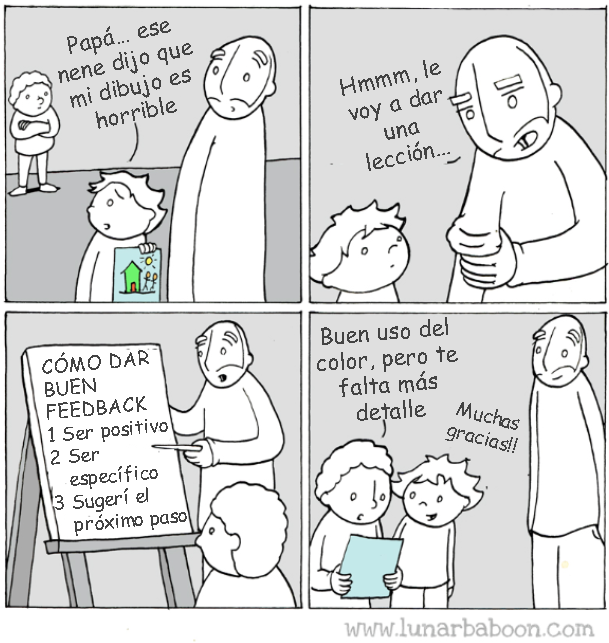
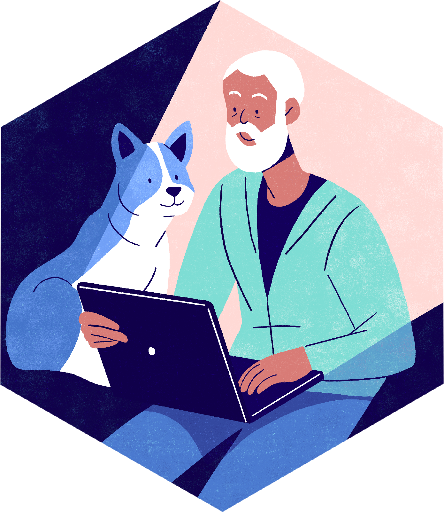

::: 
 {.title-slide-eyebrow style="text-align:center; margin-bottom:0;"} 
 
*     rOpenSci*  
**     Programa de Campeões
**
****   :::

::: 
 {style="text-align:center; margin-top:0.3em;"}
**     Orientação e Capacitação para Mentores**

Moderado por 
 **     Yani Bellini Saibene**
   :::

::: 
 {style="display:flex; align-items:center; gap:1em; margin-top:2em;"}
   

**Fontes: Mozilla Open Leaders, The Carpentries e Enseñar Tecnología en Comunidad - CC-BY-NC**
   :::

::: 
 {.notes}
   Peça permissão para gravar a reunião
   :::

***

## Reflexão sobre a mentoria 
   {background-color="#447BCD"}
   
 

:::: 
 {.columns}
   ::: 
 {.column width="58%"}
**     Duração:**    ~10 minutos

- Pense em uma experiência que você já teve em uma relação de mentoria.
- Use o documento compartilhado para responder às perguntas que aparecem ao lado do seu nome.
         :::
         ::: 
       {.column width="35%"} 
        
     

:::
::::

::: 
 {.notes}
   Como foi essa relação? Em que ela te ajudou? O que mudou para você graças a essa relação?
   O que seu mentor disse ou fez que foi útil para você?
O que deu certo/o que foi útil?
   O que não funcionou?
   Pense em um problema sobre o qual você gostaria de receber orientação neste momento.

   :::

## O que os mentores fazem?

:::: 
 {.columns}
   ::: 
   {.column width="30%"} 
   
 
   
   :::
   ::: 
   {.column width="68%"} 
   
 
   As pessoas que atuam como mentores 
 **     orientam**    e **     inspiram**   .

- **Recomendar**        recursos, leituras, treinamento, experiências
- **Dar feedback**        a ser levado em consideração
- **Conectar**        com pessoas, programas e organizações
         :::
         ::::

## Habilidades de mentoria

Resumo das habilidades que veremos hoje

:::: 
 {.columns}
   ::: 
   {.column width="30%"} 
   
 
   
   :::
   ::: 
   {.column width="68%" style="text-align:center; font-size:1.3em; margin-top:1.5em;"} 
   
 
   Escuta ativa  
   Perguntas eficazes  
   Dar feedback
   :::
   ::::

## Escuta ativa

:::: 
 {.columns}
   ::: 
   {.column width="30%"} 
   
 
   
   :::
   ::: 
   {.column width="68%"} 
    
 

- Pare de julgar e ouça.
- Dedique toda a sua atenção a quem está falando (não fique pensando no que vai dizer ou responder).
- Incentive quem está falando com sinais verbais e não verbais.
         :::
         ::::

::: 
 {.notes}
   O que é a escuta ativa?
   Como funciona a escuta ativa?
Escuta ativa: as pessoas fazem perguntas boas e perspicazes. Você pode repetir o que elas disseram.
   :::

## Perguntas eficazes

:::: 
 {.columns}
   ::: 
   {.column width="30%"} 
   
 
   
   :::
   ::: 
   {.column width="68%"} 
    
 

- Acessar informações e analisá-las
- Estimular o pensamento e a criatividade
- Aprender por meio do debate
         :::
         ::::

::: 
 {.notes}
   Por que as perguntas são importantes na orientação?

As perguntas nos permitem: ajudar a esclarecer a compreensão, fornecer uma estrutura para a discussão e estimular a criatividade.
   :::

## Dar feedback

:::: 
 {.columns}
   ::: 
   {.column width="44%"} 
   
 
   
   :::
   ::: 
   {.column width="54%"} 
    
 

- Tente ser útil
- Vá direto ao ponto. Concentre-se em comportamentos observáveis
- Fale por você mesmo
- Equilibre elogios e críticas
         :::
         ::::

::: 
   {.notes}
   O feedback pode ser uma forma de dar conselhos. Ele também permite que todos cresçam.
   O que acontece se dermos apenas feedback positivo? E se dermos apenas feedback negativo?
   :::

## Ferramentas - Reuniões

:::: 
 {.columns}
   ::: 
   {.column width="30%"} 
   
 
   
   :::
   ::: 
   {.column width="68%"} 
    
 

- Definir expectativas
  - Quais são os objetivos do programa para ambas as pessoas?
- Ferramentas para explorar e refletir
- Modelo GROW (crescer)
         :::
         ::::

::: 
 {.notes}
   Tema proposto para a primeira reunião (modelo)
Tema proposto para a última reunião (modelo)
   Exemplos por projeto para as demais reuniões (modelo)
   :::

## Modelo GROW

- **Goal (objetivo):**        Acordar um tema e um objetivo ou metas de longo prazo
- **Realidade (Reality):**        autoavaliação, exemplos concretos
- **Opções:**        sugestões oferecidas e opções escolhidas
- **Caminho a seguir:**        próximos passos

## Modelo GROW

:::: 
 {.columns style="font-size:0.62em;"}
   ::: 
 {.column width="49%"} 
 
**     GOAL - OBJETIVO**

- O que você quer alcançar?
- O que acontecerá quando você tiver alcançado isso?
- Os OBJETIVOS podem ser SMART (Específicos, Mensuráveis, Alcançáveis, Realistas, com Prazo Definido).

**REALIDADE**

- O que está acontecendo neste momento?

- O que está impedindo você de seguir em frente?

- O que você já tentou?

- O que aconteceu?

- O que você aprendeu?
         :::
         ::: 
 {.column width="49%"} 
 
  **         OPTIONS - OPÇÕES**

- O que você poderia fazer? O que mais?

- Quais são as vantagens/desvantagens de cada opção?

- Quer que eu te dê algumas sugestões?

- Quais opções você mais gosta?

**WAY FORWARD - COMO SEGUIR**

- O que você vai fazer?
- Qual será o primeiro passo?
- Quando você vai começar e terminar cada etapa?
- De que apoio você precisa e de quem?
         :::
         ::::

## Modelo GROW 
   {background-color="#447BCD"}
   
 

:::: 
 {.columns}
   ::: 
 {.column width="58%"}
**     Duração:**    ~10 minutos

- Vocês vão trabalhar em grupos.
- Assistam ao vídeo cujo link está no documento compartilhado, que mostra um exemplo de uso do modelo GROW. Identifiquem no vídeo as etapas do modelo.
         :::
         ::: 
       {.column width="35%"} 
        
     

:::
::::

## Modelo GROW 
   {background-color="#447BCD"}
   
 

:::: 
 {.columns}
   ::: 
 {.column width="58%"}
**     Duração:**    ~10 minutos

- Vocês vão trabalhar em grupos.
- Pratiquem o modelo GROW. Um de vocês será o mentor, e o outro, o “campeão”. Usem o tema sobre o qual vocês disseram precisar de ajuda na primeira pergunta.
         :::
         ::: 
       {.column width="35%"} 
        
     

:::
::::

## Dicas para o modelo GROW

:::: 
 {.columns}
   ::: 
   {.column width="30%"} 
   
 
   
   :::
   ::: 
   {.column width="68%"} 
    
 

- 'Perguntar' em vez de 'contar'
- Explicar e verificar a compreensão
- Mesmo sendo o especialista, você atua como facilitador(a).
         :::
         ::::

## Dicas de mentores anteriores

::: 
   {style="font-size:0.75em;"} 
    
 

- *Deixe seu aprendiz falar mais do que você e, acima de tudo, incentive-o na direção necessária.*
- *Provavelmente tentaria aproveitar mais os chats assíncronos do Slack. Encontrar momentos para nos reunirmos e ter uma conexão com a Internet boa o suficiente para fazer videoconferências foi um verdadeiro desafio.*
- *Conversar mais com os outros mentores.*
- *Promova um contato regular com seu mentorado. Converse com frequência e sobre outros assuntos além do programa.*
         :::

## Dicas de mentores anteriores

::: 
   {style="font-size:0.62em;"} 
    
 

- *Eu recomendaria aos mentores que participassem do maior número possível de sessões de treinamento e de coworking. Se possível, conhecer seu mentorado pessoalmente também pode ser extremamente benéfico para construir um relacionamento melhor.*
- *Use o documento do calendário mensal*
- *Não se preocupe em saber o suficiente; há recursos disponíveis sobre todos os aspectos da mentoria nos quais você pode confiar.*
- *Mantenha um relacionamento enriquecedor com seu mentorado, tanto do ponto de vista técnico quanto não técnico.*
- *O conhecimento técnico é importante, mas muitas vezes é menos importante do que dedicar tempo para compreender de verdade o projeto e os objetivos do seu mentorado. Concentre-se em apoiar o sucesso dele, ouvindo com atenção e ajudando-o a encontrar o melhor caminho a seguir.*
   
        :::

## Ferramentas

:::: 
 {.columns}
   ::: 
   {.column width="30%"} 
   
 
   
   :::
   ::: 
   {.column width="65%"} 
    
 

### [Guia para Mentores](https://ropensci-org.github.io/champions-mentor-guidelines/)

- [Modelo de reuniões](https://docs.google.com/document/d/1VtNYfDNYRS7xAbs1Ajf2S5wsv3mOQ0BcTn93cXAv6sc/)
- [Calendário mensal](https://docs.google.com/document/d/14Q-8sJTtKyGIZTGSIP13iWKyHmCzAyJo_BiDlwj15s8/)
- [Calendário compartilhado](https://calendar.google.com/calendar/embed?src=c_73ae7d17e0d4742c6c3f3ee4f852938ceb6e76a85d98e18e4f92098f690217b5%40group.calendar.google.com&ctz=America%2FArgentina%2FCordoba)
- [Relatório de reuniões](https://airtable.com/appF6OXmxkk8VmR8a/shrV3SruqtGwe1Bdj)
- [Código de Conduta](https://ropensci.org/es/c%C3%B3digo-de-conducta/)
- Canais no Slack
- [Google Drive](https://drive.google.com/drive/folders/1W_qXERn2-i-aLqb-Lb9wJFvFYdGLgH4v)
         :::
         ::::

## Perguntas e respostas 
   {background-color="#447BCD"}
   
 

:::: 
 {.columns}
   ::: 
 {.column width="58%"}
**     Duração:**    ~10 minutos

No documento compartilhado, ao lado do seu nome, responda a

**Você se sente preparado(a) para ser mentor(a)?**
   :::
   ::: 
   {.column width="35%"} 
   
 
   
   :::
   ::::

## Feedback sobre este workshop 
   {background-color="#447BCD"}
   
 

:::: 
 {.columns}
   ::: 
 {.column width="58%"} 
 
**     Duração:**    ~5 minutos

- Vamos praticar como dar nossa opinião: responda à nossa pesquisa anônima sobre este workshop.
- Ajude-nos a melhorá-lo.
         :::
         ::: 
       {.column width="35%"} 
        
     

:::
::::

