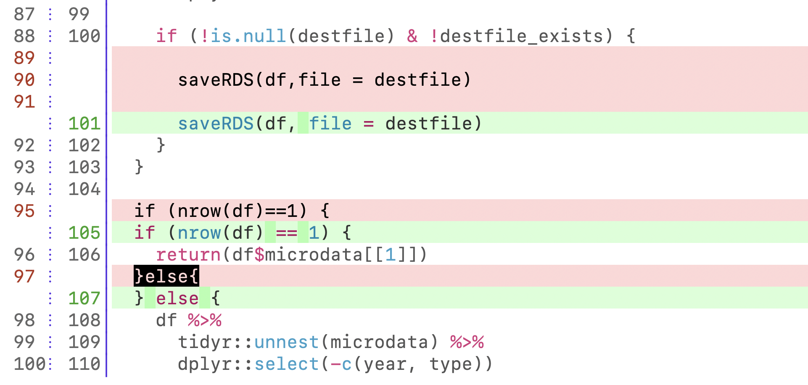
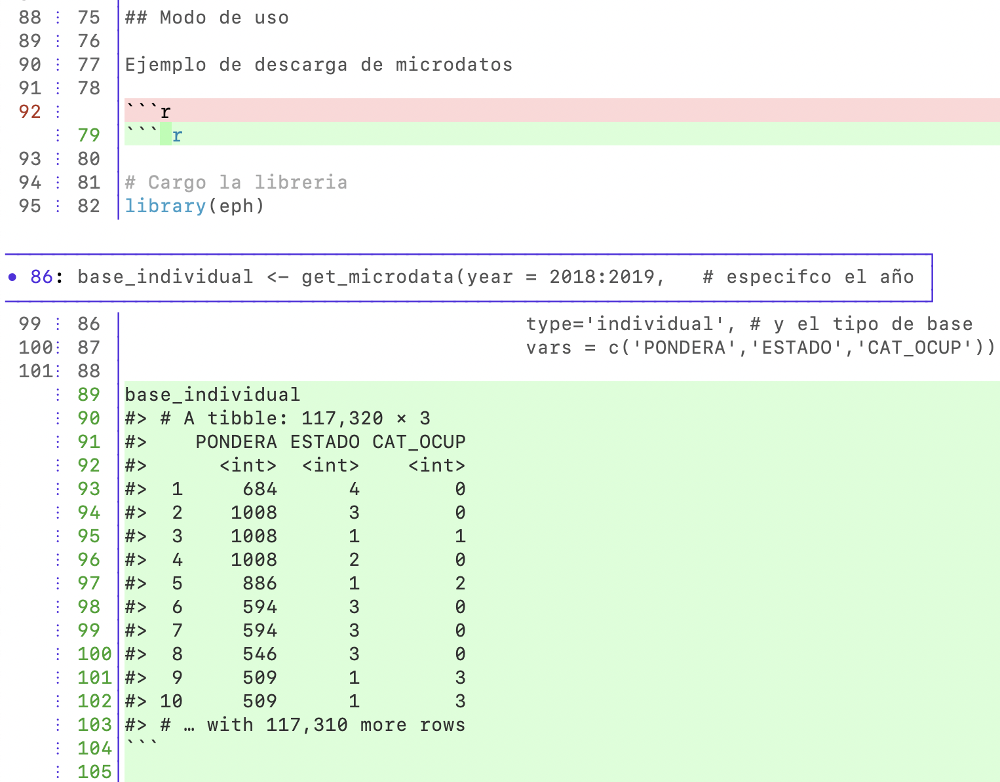

::: {.callout-note}
## Being refined

You are reading the **first edition in progress and in English** of this book, based on the training curriculum of the rOpenSci Champions Program. 
This chapter should be readable, but it is undergoing final polishing.

*Source of the migrated content:* this chapter originates from the
 [software-review](https://github.com/ropensci-training/software-review) repository.
:::

# Workshop Introduction

About [you](https://ropensci.org/champions/) 🏅🌐 and about [me](https://ropensci.org/author/mauro-lepore/) 👋.

<sub>
License: [Attribution-NonCommercial 4.0 International](https://creativecommons.org/licenses/by-nc/4.0/deed.en)
</sub>

## Main Objectives

Day 1

- Familiarize yourself with the stages and qualities of the process
- Practice proposing software for review

Day 2

- Practice submitting software for review

## Day 1 Plan

* Workshop introduction
* End-to-end process introduction
  - Comparison with academia
  - Proposing and submitting software for review
  - {pkgcheck}
  - Code of conduct and communication
* Break
* Proposing software for review
  - Opening an issue
  - Kind and constructive communication
* Questions and comments

# Review Process Overview

About how we work with [software](https://devguide.ropensci.org/index.html) and [people](https://ropensci.org/code-of-conduct/)

::: {.callout-note icon=false}
## Comparison with Academia

How would you describe the communication between authors and reviewers in academia and rOpenSci?
:::

## [Proposing Software for Review](https://github.com/ropensci/software-review/issues?q=is%3Aissue%20state%3Aopen%20label%3A0%2Fpresubmission)

```{mermaid}
flowchart LR
    B((1-Open issue))
    B --> C{2-In scope?}
    C -->|No| E{3-Exception?}
    C -->|Yes| D[4-Submit]
    E -->|Yes| D
    E -->|No| G((5-Close issue))
```

## [Submitting Software for Review](https://github.com/ropensci/software-review/issues)

```{mermaid}
flowchart LR
    B((1-Open issue))
    B --> C[2-Review]
    C --> D{3-Ready?}
    D -->|No| C
    D -->|Yes| E((Publish))
```

## {pkgcheck}: Usage in an Issue

```r
@ropensci-review-bot check package
```

[Example](https://github.com/ropensci/software-review/issues/593#issuecomment-1608404055)

:::aside
[Bot commands](https://devguide.ropensci.org/bot_cheatsheet.html)
:::

## {pkgcheck}: Local Usage

::: {.callout-note icon=false}
### Installation

```r
  options (repos = c (
    ropenscireviewtools = "https://ropensci-review-tools.r-universe.dev",
    CRAN = "https://cloud.r-project.org"
  ))
  install.packages("pkgcheck")
```

Also you'll need to run `pkgstats::ctags_install()` on Linux, or `brew install global` from the terminal on MacOS.
:::

Usage

```r
  package <- "/path/to/package"
  results <- pkgcheck::pkgcheck(package)
  results

  summary(results)
```

:::aside
[{pkgcheck} documentation](https://docs.ropensci.org/pkgcheck/)
:::

## Code of Conduct

- rOpenSci’s community is our best asset.  
- We aim for reviews to be  
  - open, 
  - non-adversarial, 
  - and focused on improving software quality.
- Be respectful and kind.  

:::aside
[Guide for reviewers](https://devguide.ropensci.org/softwarereview_reviewer.html)  
[Guide for editors](https://devguide.ropensci.org/softwarereview_editor.html)  
[Code of Conduct](https://ropensci.org/code-of-conduct/)  
:::

## Kind and Constructive Communication

Offer

- Safety
- Suggestion/Decision
- Follow-up

:::aside
[How to Win Friends and Influence People](https://www.amazon.com/-/es/influir-personas-Friends-Influence-Spanish/dp/164473009X)
[Crucial Conversations: Tools for Talking When Stakes Are High](https://www.amazon.com/Conversaciones-Cruciales-Edici%C3%B3n-revisada-conocimiento-ebook/dp/B01EX1TZQG/ref=sr_1_1?adgrpid=167955646707&dib=eyJ2IjoiMSJ9.Ws1WzIBF0cC2Dm2-H47hguDVuXRPmMy9rZLGRYA4t3ER8EP9QL1L1dPW8a2l0c2aI65gElZhBVvYTfIcqtuaBVQcnOAmIBffgVzFQKm44rUISeaXgEIVBBw4-muztHHDiwE9jwRJSFYtSDFMAq4h9Rvb-GvpCxfZNzbfBApAjBAXNIQ63XVjTnFrOly1C-YCBSC8uEVyOljvl5CfMMfShGRKX-fYLjSLXyU0CJW-xuk.LRH-a9xfbt1VH_6O1wTX-6nxoUp_g1gSKmBPfElISuA&dib_tag=se&hvadid=730129623296&hvdev=c&hvlocphy=9070297&hvnetw=g&hvqmt=e&hvrand=357311298508997420&hvtargid=kwd-319512755646&hydadcr=23800_13790585&keywords=conversaciones+cruciales&mcid=bd94c27aa7253eda9e137472f79bfcd2&qid=1763123775&sr=8-1)
:::

## Kind and Constructive Communication

From an author:

> I couldn't find a category that fit perfectly, so I created a new category.

::: {.callout-note icon=false}
### How would you score each response from an editor (1-10)?

<details><summary>Response 1</summary>

`@editor`:

> @author,
> Unfortunately our categories are pre-defined. We hope to expand them gradually, but we cannot accommodate individual packages.

</details>

<details><summary>Response 2</summary>

`@editor`:

> @author, thank you for your inquiry. The package looks very interesting but unfortunately it's outside the scope of rOpenSci's current categories. Our categories are pre-defined. We hope to expand them gradually, but we cannot accommodate individual packages.

</details>

<details><summary>Response 3</summary>

`@editor`:

> @author, thank you for your inquiry. The package looks very interesting but unfortunately it's outside the scope of rOpenSci's current categories. Our categories are pre-defined. We hope to expand them gradually, but we cannot accommodate individual packages.

> I would recommend reviewing and publishing the package in the [Journal of Open Source Software](https://joss.theoj.org/).

> I hope we can work with you on another package soon.

</details>
:::

:::aside
[Deciding on scope and overlap](https://devdevguide.netlify.app/softwarereview_editor#deciding-on-scope-and-overlap)
:::

# Break 10'

# Proposing Software for Review

::: {.callout-note icon=false}
## Open an issue to propose software for review in the [practice repository](https://github.com/ropensci-training/software-review/issues)

Use your own package or any of these:

- [{agroclimatico}](https://github.com/ropensci/software-review/issues/599): Climate and Hydrological Indices and Statistics
- [{eph}](https://github.com/ropensci/software-review/issues/593): Argentina's Permanent Household Survey Data and Manipulation Utilities
- [{karel}](https://github.com/ropensci/software-review/issues/620): Learning programming with Karel the robot
:::

::: {.callout-note icon=false}
## Use of AI

We received several packages developed with AI and with a very short commit history. To face this challenge, JOSS requires a commit history of at least six months.

- Tell us if/how you use AI
- Share your opinion on whether rOpenSci should imitate JOSS policy.
:::

:::aside
[*Projects developed privately are not eligible until there is a public record of open development: at least six months -- JOSS*](https://joss.readthedocs.io/en/latest/submitting.html#scope-and-significance)
:::

# Questions and Comments

# Day 2 Introduction

What did we see on day 1? What are we going to see today?

## Day 2 Plan

* Review
* Preparing a package
* Reviewing a package: Introduction
* Break
* Reviewing a package: Activity
* Responding to a review
* Questions and answers

## Review: Proposing Software

The [karel](https://github.com/ropensci/software-review/issues/620) package teaches programming. Its objective is outside the scope of rOpenSci. It was proposed for review in 2023, during the champions program.

::: {.callout-note icon=false}
### Was it correct for it to have been reviewed at rOpenSci?

1. No because it doesn't fit the scope
1. Yes because although it doesn't fit the scope it's an exception
1. Yes because rOpenSci doesn't reject packages
:::

<details><summary>[Proposing software for review](https://github.com/ropensci/software-review/issues)</summary>

```{mermaid}
flowchart LR
    B((1-Open issue))
    B --> C{2-In scope?}
    C -->|No| E{3-Exception?}
    C -->|Yes| D[4-Submit]
    E -->|Yes| D
    E -->|No| G((5-Close issue))
```

</details>

## Review: Communication

::: {.callout-note icon=false}
### Why do we prefer the second response?

1. Actually we prefer the first one because it communicates the same decision but is shorter.
1. Because it's more politically correct.
1. Because it demonstrates that rOpenSci is a safe space to make inquiries, suggests an alternative forum, and invites future contributions.

<details><summary>Response 1</summary>

> @author,
> Unfortunately this package is outside rOpenSci's current scope.
</details>

<details><summary>Response 2</summary>

> @author,
> Thank you for your inquiry. Your package looks very interesting, but unfortunately it doesn't seem to fit rOpenSci's current categories.
> I would recommend publishing it in the [Journal of Open Source Software](https://joss.theoj.org/), the [r-multiverse](https://r-multiverse.org/overview.html) or [other repositories](https://r-multiverse.org/overview.html#other-repositories). And if you have another package or want to [explore how to contribute in other ways](https://contributing.ropensci.org/), we'll be happy to guide you.

</details>
:::

# Submitting Software for Review

::: {.callout-note icon=false}
## Preparing a Package

Generate, interpret, and respond to [{pkgcheck}](https://docs.ropensci.org/pkgcheck/) results

<details><summary>Installation</summary>

```r
  options (repos = c (
    ropenscireviewtools = "https://ropensci-review-tools.r-universe.dev",
    CRAN = "https://cloud.r-project.org"
  ))
  install.packages("pkgcheck")
```

</details>

Use any package, e.g. [{saperlipopette v0.1.0}](https://github.com/ropensci-training/saperlipopette)

<details><summary>Clone it and checkout v0.1.0</summary>

```bash
git clone https://github.com/ropensci-training/saperlipopette
cd saperlipopette
git checkout v0.1.0
```

</details>

```r
# pak::pak()
out <- pkgcheck::pkgcheck()
summary(out)

out
```
:::

<details><summary>Example</summary>

```r
# install.packages("usethis")

# ✖ does not have a 'contributing' file.
usethis::use_tidy_contributing()

# ✖ Package has no HTML vignettes
usethis::use_article("saperlipopette")

# ✖ These functions do not have examples: [create_all_exercises].
# From https://github.com/ropensci-training/saperlipopette/blob/main/R/create-all.R
#' @examplesIf interactive()
#' parent_path <- withr::local_tempdir()
#' path <- create_all_exercises(parent_path = parent_path)
#
# devtools::document()
```

</details>

## Reviewing a Package

::: {.callout-note icon=false}
### Propose (only) one improvement. Use the [review template](https://devdevguide.netlify.app/reviewtemplate).

You can use your package or any of these -- **before the review**:

<details><summary>[{agroclimatico}](https://github.com/ropensci/agroclimatico): Climate and Hydrological Indices and Statistics</summary>

```bash
git clone https://github.com/ropensci/agroclimatico
cd agroclimatico
git checkout -b antes d537dd20
```

</details>

<details><summary>[{eph}](https://github.com/ropensci/eph): Argentina's Permanent Household Survey Data and Manipulation Utilities</summary>

```bash
git clone https://github.com/ropensci/eph
cd eph
git checkout -b antes 707cd24c
```

</details>

<details><summary>[{karel}](https://github.com/ropensci/karel): Learning programming with Karel the robot</summary>

```bash
git clone https://github.com/ropensci/karel
cd karel
git checkout -b antes 4b057e67
```

</details>
:::

<details><summary>Examples</summary>

{eph}: Use an automatic code formatter ([review](https://github.com/ropensci/software-review/issues/593#issuecomment-1624466962) - [commit](https://github.com/ropensci/eph/commit/eca3401fb59ad9d9cdb14abcea7b96565fff6161)).

> Please use an automatic code formatter (e.g., `usethis::use_tidy_style()`). It's useful to see that the style is consistent and follows a popular style guide like the "tidyverse style guide" (https://style.tidyverse.org/). This helps avoid thinking about style and saves mental energy for noticing more important things. Here are some examples of style violations:



{eph}: Show the output of examples in README ([review](https://github.com/ropensci/software-review/issues/593#issuecomment-1624466962) - [commit](https://github.com/ropensci/eph/commit/322d7003fccdf06e68e03cc4aa0a034fda3a4721)).

> In the "Usage" section, please show the results so they can be seen without needing to install the package and run the code.

